# PROMPT INICIAL - Sistema de Gestión de Inversiones

- Version = `00`
- Release = `001`
- Hotfix = `001`

## Fecha: 2026-09-19

## Proyecto: Investment Tracker Pro

### Descripción General

Aplicación web para seguimiento de inversiones con arquitectura de microservicios usando Docker.

### Requisitos Funcionales

**Autenticación y seguridad**

1. Sistema de autenticación con JWT y Refresh Token (sesión deslizante de 1 hora).
2. Gestión de roles de usuario (`ROLE_ADMIN`, `ROLE_USER`, `ROLE_PREMIUM`).
3. Registro de usuarios en dos pasos con confirmación por email (token de 6 dígitos, TTL 5 min).
4. Recuperación de contraseña con 2FA vía SMTP (token de 6 dígitos, TTL 5 min).
5. Cambio de contraseña propia con validación de la contraseña actual.
6. Restablecimiento de contraseña por parte de un administrador.
7. Borrado lógico de cuenta por parte del propio usuario autenticado.
8. Control de intentos fallidos con bloqueo progresivo (5min → 15min → 30min → 1h → 12h → 24h → permanente).
9. Encriptación bidireccional AES-256-GCM para datos sensibles y hash BCrypt para contraseñas.
10. **Auditoría de usuarios**: registro automático de INSERT/UPDATE/DELETE/Login sobre la tabla `usuarios`, con snapshots JSONB, campos modificados y usuario autenticado.

**Gestión de inversiones**

11. Registro de inversiones en múltiples plataformas (brokers, exchanges).
12. Gestión de comisiones variables por plataforma (porcentaje y/o valor fijo, con vigencia temporal).
13. Registro de compras y ventas de acciones (cantidad, precio unitario, comisión, valor total).
14. Soporte multimoneda (54 divisas internacionales con código ISO, símbolo y país).
15. Asociación de cada usuario a un país (con indicativo celular) y número de celular único por país.

**Análisis y reportes**

16. Dashboard con el total de movimientos y el resultado (positivo o negativo) de las inversiones.
17. Función `calcular_venta_optima` para determinar el precio mínimo de venta y la cantidad óptima que maximiza la ganancia deseada, considerando las comisiones vigentes.
18. Historial de cálculos de venta óptima por usuario y plataforma (`calculos_hist`).

### Gestión del Proyecto

El seguimiento de la planeación, avances, backlog e issues se realiza en el tablero de GitHub Projects:

- **Tablero**: [Investment Tracker Pro - Project Board](https://github.com/users/42mrnobody42-alt/projects/2)
- **Repositorio**: [investment-tracker](https://github.com/42mrnobody42-alt/investment-tracker)

Las tareas del proyecto se organizan en el tablero con los siguientes estados sugeridos:

| Estado        | Descripción                                    |
| ------------- | ---------------------------------------------- |
| `Backlog`     | Ideas y funcionalidades no priorizadas         |
| `Ready`       | Listas para ser tomadas en el siguiente sprint |
| `In progress` | En desarrollo activo                           |
| `In review`   | Pull Request abierto, pendiente de revisión    |
| `Done`        | Mergeado a `developer`                         |

> **Nota**: Los issues y Pull Requests deben vincularse al tablero para mantener trazabilidad entre el código y la planeación.

---

## 📚 Documentos de referencia obligatoria

Este README es la fuente principal del proyecto, pero existen documentos complementarios que deben consultarse antes de cualquier cambio. Jerarquía en caso de conflicto: **README.md** → **prompt_inicial.md** → **agentes por capa**.

1. **`docs/prompts/prompt_inicial.md`**
   - Idea general del proyecto, requisitos funcionales, reglas para la IA, directrices por capa (backend, DB, frontend) y flujo obligatorio por issue del tablero.
   - Ruta: `docs/prompts/prompt_inicial.md`.

2. **`docs/prompts/agente-frontend.md`**
   - Reglas obligatorias de arquitectura y desarrollo del frontend: estructura de directorios, vistas por orientación (horizontal/vertical), design system, i18n, assets editables en runtime, Storybook, testing, a11y, performance, seguridad, solicitud de archivos y definición de "Done" por PR.
   - Ruta: `docs/prompts/agente-frontend.md`.

3. **`docs/prompts/agente-backend.md`**
   - Reglas del backend: arquitectura hexagonal, DTOs, manejo de errores por dominio, seguridad (JWT, refresh token, AES-256-GCM, BCrypt), ofuscación (`@Masked`), auditoría (`AuditUserAwareDataSource`), testing y DoD por PR.
   - Ruta: `docs/prompts/agente-backend.md`.

4. **`docs/prompts/agente-database.md`**
   - Reglas de la base de datos: estructura de `database/sql/`, nomenclatura `Version_Release_Hotfix_Orden_Prefijo_Nombre.sql`, idempotencia, permisos `investor`/`investment_app`, auditoría con `SECURITY DEFINER`, funciones PL/pgSQL y migraciones.
   - Ruta: `docs/prompts/agente-database.md`.

5. **`docs/frontend/*.md`** y **`docs/sql/*.sql`**
   - Profundizan en arquitectura, design system, i18n, assets, storybook, testing y consultas de referencia.

**Regla de solicitud de archivos**: cuando un agente (humano o IA) necesite contexto que no está en los documentos anteriores, DEBE solicitar los archivos concretos (ruta + motivo) antes de continuar. Nunca inventar endpoints, DTOs, campos, códigos de error ni estructuras. El procedimiento detallado vive en `docs/prompts/agente-frontend.md` sección 21 y en `docs/prompts/prompt_inicial.md` (Reglas generales para la IA, reglas 24-28).

**Consistencia**: cualquier cambio en endpoints, DTOs, roles, códigos de error o convenciones de frontend debe reflejarse en el mismo PR en este README, en `prompt_inicial.md` y/o en el agente correspondiente.

# Investment Tracker Pro - Documentación Completa

## ÍNDICE

- [1. Arquitectura del Sistema](#1-arquitectura-del-sistema)
  - [Diagrama de Arquitectura](#diagrama-de-arquitectura)

- [2. Base de Datos](#2-base-de-datos)
  - [Estructura de Scripts SQL](#estructura-de-scripts-sql)
  - [Diagrama MER (Modelo Entidad-Relación)](#diagrama-mer-modelo-entidad-relación)
    - [Login](#login)
    - [Negocio](#negocio)
    - [Auditorias](#auditorias)
  - [Relaciones Clave](#relaciones-clave)
  - [Funciones PL/pgSQL Disponibles](#funciones-plpgsql-disponibles)
  - [Auditoría de usuarios](#auditoría-de-usuarios)
  - [Datos de Prueba](#datos-de-prueba)

- [3. Backend - Java Spring Boot](#3-backend---java-spring-boot-3x)
  - [Servicios Publicados](#servicios-publicados)
    - [🔐 Seguridad](#-seguridad)
    - [🔑 Login](#-login)
    - [👤 Usuarios](#-usuarios)
    - [💼 Negocio](#-negocio)
    - [🧪 Sistema / Utilidades](#-sistema--utilidades)
  - [Diagrama de Secuencia de los Servicios](#diagrama-de-secuencia-de-los-servicios-publicados)
    - [Login](#login-1)
    - [Restart Password (solo ADMIN)](#restart-password-solo-admin)
    - [Encriptar Texto (ADMIN)](#encriptar-texto-admin)
    - [Desencriptar Texto (ADMIN)](#desencriptar-texto-admin)
    - [Logout (Cerrar Sesión)](#logout-cerrar-sesión)
    - [Recuperación de Contraseña (2FA SMTP)](#recuperación-de-contraseña-2fa-smtp)
    - [Refresh Token](#refresh-token)
    - [Change My Password](#change-my-password)
    - [Registro de Usuario](#registro-de-usuario)
    - [Borrado de Cuenta](#borrado-de-cuenta)
    - [Obtener Perfil Propio (GET)](#obtener-perfil-propio-get)
    - [Actualizar Perfil Propio (POST)](#actualizar-perfil-propio-post)
    - [Ofuscación de salida (login enmascarado)](#ofuscación-de-salida-login-enmascarado)
    - [Endpoint de datos propios (sin ofuscar)](#endpoint-de-datos-propios-sin-ofuscar)
  - [Seguridad](#seguridad)
  - [Perfil de Usuario](#perfil-de-usuario)
  - [Ofuscación de datos sensibles](#ofuscación-de-datos-sensibles)
    - [Componentes](#componentes)
    - [Formatos de ofuscación](#formatos-de-ofuscación)
    - [Decisión de diseño](#decisión-de-diseño)
    - [Cómo extender](#cómo-extender)
    - [Filtro de logs sensibles](#filtro-de-logs-sensibles)
  - [Códigos de Error](#códigos-de-error)
  - [Pruebas](#pruebas)

- [4. Frontend - React y CSS moderno](#4-frontend---react-y-css-moderno)

- [5. Nginx - publicación](#5-nginx---publicación)

- [100. Servicios Docker](#100-servicios-docker)
  - [Servicios](#servicios)
  - [Scripts de Mantenimiento](#scripts-de-mantenimiento)
    - [Verificar sistema completo](#verificar-sistema-completo)
    - [Reset base de datos](#reset-base-de-datos-mantiene-configuración-pgadmin)
    - [Reset solo pgadmin](#reset-solo-pgadmin)
    - [Backup base de datos](#backup-base-de-datos)
    - [Restaurar backup](#restaurar-backup)

- [101. Estructura del Proyecto](#101-estructura-del-proyecto)
  - [Estructura detallada de archivos](#estructura-detallada-de-archivos)

- [102. Historial de Versiones](#102-historial-de-versiones)

- [103. Requisitos Funcionales](#103-requisitos-funcionales)

- [104. Stack Tecnológico](#104-stack-tecnológico)

- [105. Gestión del Proyecto](#105-gestión-del-proyecto)

- [106. Gestión Scrum con GitHub Projects](#106-gestión-scrum-con-github-projects)

---

## 1. ARQUITECTURA DEL SISTEMA

### Diagrama de Arquitectura

```
┌─────────────────────────────────────────────────────────────┐
│                      🌐 CLIENTE (HTTPS)                      │
│                   React SPA + Axios + JWT                    │
└──────────────────────────┬──────────────────────────────────┘
                           │
                           ▼
┌─────────────────────────────────────────────────────────────┐
│                   🔒 NGINX Reverse Proxy                     │
│                      Puerto: 443 (SSL/TLS)                   │
│                  Redirección: / → Frontend                   │
│                              /api → Backend                  │
└──────────────────────────┬──────────────────────────────────┘
                           │
            ┌──────────────┴──────────────┐
            ▼                             ▼
┌───────────────────────┐    ┌────────────────────────────────┐
│   🎨 FRONTEND (3000)   │    │   ⚙️  BACKEND (7700)            │
│   React 18 + CSS       │    │   Spring Boot 3.x + Java 21   │
│   Nginx/Alpine         │    │   Tomcat 10 Embedido           │
│   SPA + React Router   │    │   JWT Authentication           │
└───────────────────────┘    └──────────────┬─────────────────┘
                                            │
                    ┌───────────────────────┴
                    │
                    ▼
┌──────────────────────────────┐    ┌──────────────────────────────┐
│   🗄️  PostgreSQL 16 (5432)    │◄──│   📊 pgAdmin 4 (5050)        │
│   Esquema: investment_tracker│    │   Admin DB Web UI            │
│   PL/pgSQL + UUID + 54 monedas│   │   http://localhost:5050       │
└──────────────────────────────┘    └──────────────────────────────┘
```

## 2. BASE DE DATOS

### Estructura de Scripts SQL

Los scripts de base de datos siguen un estándar de organización y versionado:

- **Directorio `database/sql/install/`**: contiene todos los scripts para una instalación completa desde cero.
- **Directorio `database/sql/updates/`**: contiene scripts de migración incremental (por versión, release o hotfix).

Dentro de cada directorio, los scripts se agrupan en subdirectorios numerados según su tipo:

- `10_esquemas/` - Creación de esquemas y tabla `schema_version` (incluye extensión `uuid-ossp`).
- `20_extensiones/` - Extensiones adicionales (opcional, aquí se mantiene `uuid-ossp` por compatibilidad).
- `40_tablas/` - Definición de tablas (una por archivo). El orden actual es:
  - `01_cr_monedas.sql` - Tabla `monedas` (divisas).
  - `02_cr_paises.sql` - Tabla `paises` (países con código ISO e indicativo celular, relacionada con `monedas`).
  - `03_cr_roles.sql` - Tabla `roles`.
  - `04_cr_usuarios.sql` - Tabla `usuarios` (incluye `celular` y `pais_id`).
  - `05_cr_usuario_roles.sql` - Tabla de relación usuarios-roles.
  - `06_cr_plataformas.sql` - Tabla `plataformas`.
  - `07_cr_comisiones.sql` - Tabla `comisiones`.
  - `08_cr_transacciones.sql` - Tabla `transacciones`.
  - `09_cr_calculos_hist.sql` - Tabla `calculos_hist`.
  - `10_cr_auditoria_usuarios.sql` - Tabla `auditoria_usuarios` (bitácora de cambios en `usuarios`).
- `70_indices/` - Índices de rendimiento y unicidad (incluye índices funcionales para `username` y `email` case-insensitive, y el índice compuesto `(pais_id, celular)`; además, `07_cr_idx_auditoria_usuarios.sql` con índices para la bitácora).
- `90_funciones/` - Funciones PL/pgSQL (una por archivo).
- `110_disparadores/` - Trigger y función de auditoría (`trg_audit_usuarios`, `fn_audit_usuarios`).
- `140_datos_basicos/` - Datos iniciales (monedas, países, roles, usuarios, etc.) en el mismo orden que las tablas.
- `150_permisos/` - Creación del rol `investment_app` (usuario de BD del backend) y GRANT/REVOKE sobre las tablas de negocio.
- `160_comentarios/` - Comentarios de documentación de la tabla de auditoría.

**Nomenclatura:**  
`Version_Release_Hotfix_Orden_Prefijo_Nombre.sql`  
Ejemplo: `00_001_000_01_cr_monedas.sql`

**Scripts de construcción:**

- `CreateInstallSqlInvestmentTracker.sh` → genera `database/sql/aplica.sql` con referencias `\ir` a todos los scripts de `install/`.
- `CreateRelease00_001_000SqlInvestmentTracker.sh` → genera `database/sql/aplica_00_001_000.sql` para migraciones específicas.

**Inicialización en Docker:**  
El contenedor PostgreSQL ejecuta `docker/postgres/init.sh` al iniciarse. Este script verifica si el esquema `investment_tracker` ya existe; si no, ejecuta `aplica.sql` para instalar todo desde cero. Esto asegura que la base de datos se inicialice solo la primera vez y preserve los datos en reinicios posteriores.

### Diagrama MER (Modelo Entidad-Relación)

#### Login

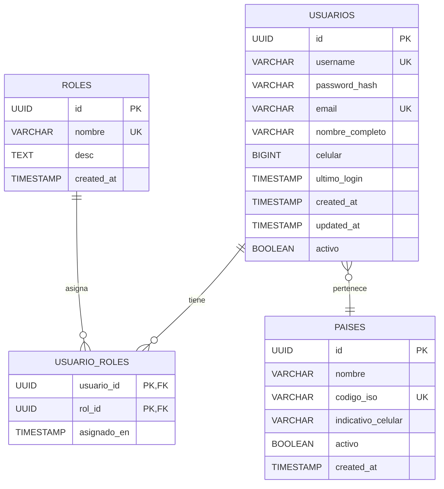
```mermaid
erDiagram
    ROLES {
        UUID id PK
        VARCHAR nombre UK
        TEXT desc
        TIMESTAMP created_at
    }
    USUARIOS {
        UUID id PK
        VARCHAR username UK
        VARCHAR password_hash
        VARCHAR email UK
        VARCHAR nombre_completo
        BIGINT celular
        TIMESTAMP ultimo_login
        TIMESTAMP created_at
        TIMESTAMP updated_at
        BOOLEAN activo
    }
    PAISES {
        UUID id PK
        VARCHAR nombre
        VARCHAR codigo_iso UK
        VARCHAR indicativo_celular
        BOOLEAN activo
        TIMESTAMP created_at
    }
    USUARIO_ROLES {
        UUID usuario_id PK,FK
        UUID rol_id PK,FK
        TIMESTAMP asignado_en
    }
    USUARIOS ||--o{ USUARIO_ROLES : tiene
    ROLES ||--o{ USUARIO_ROLES : asigna
    USUARIOS }o--|| PAISES : pertenece
```

#### Negocio

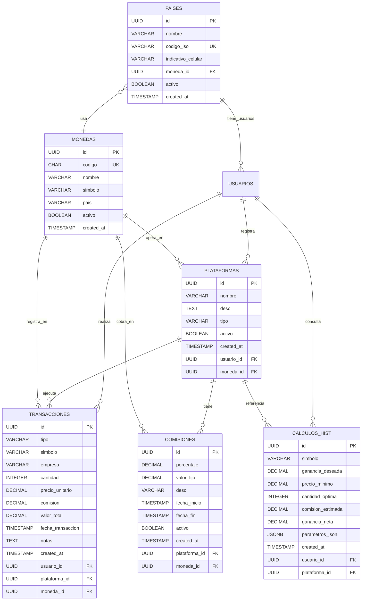
```mermaid
erDiagram
    MONEDAS {
        UUID id PK
        CHAR codigo UK
        VARCHAR nombre
        VARCHAR simbolo
        VARCHAR pais
        BOOLEAN activo
        TIMESTAMP created_at
    }
    PAISES {
        UUID id PK
        VARCHAR nombre
        VARCHAR codigo_iso UK
        VARCHAR indicativo_celular
        UUID moneda_id FK
        BOOLEAN activo
        TIMESTAMP created_at
    }
    PLATAFORMAS {
        UUID id PK
        VARCHAR nombre
        TEXT desc
        VARCHAR tipo
        BOOLEAN activo
        TIMESTAMP created_at
        UUID usuario_id FK
        UUID moneda_id FK
    }
    COMISIONES {
        UUID id PK
        DECIMAL porcentaje
        DECIMAL valor_fijo
        VARCHAR desc
        TIMESTAMP fecha_inicio
        TIMESTAMP fecha_fin
        BOOLEAN activo
        TIMESTAMP created_at
        UUID plataforma_id FK
        UUID moneda_id FK
    }
    TRANSACCIONES {
        UUID id PK
        VARCHAR tipo
        VARCHAR simbolo
        VARCHAR empresa
        INTEGER cantidad
        DECIMAL precio_unitario
        DECIMAL comision
        DECIMAL valor_total
        TIMESTAMP fecha_transaccion
        TEXT notas
        TIMESTAMP created_at
        UUID usuario_id FK
        UUID plataforma_id FK
        UUID moneda_id FK
    }
    CALCULOS_HIST {
        UUID id PK
        VARCHAR simbolo
        DECIMAL ganancia_deseada
        DECIMAL precio_minimo
        INTEGER cantidad_optima
        DECIMAL comision_estimada
        DECIMAL ganancia_neta
        JSONB parametros_json
        TIMESTAMP created_at
        UUID usuario_id FK
        UUID plataforma_id FK
    }
    USUARIOS ||--o{ PLATAFORMAS : registra
    MONEDAS ||--o{ PLATAFORMAS : opera_en
    PLATAFORMAS ||--o{ COMISIONES : tiene
    MONEDAS ||--o{ COMISIONES : cobra_en
    USUARIOS ||--o{ TRANSACCIONES : realiza
    PLATAFORMAS ||--o{ TRANSACCIONES : ejecuta
    MONEDAS ||--o{ TRANSACCIONES : registra_en
    USUARIOS ||--o{ CALCULOS_HIST : consulta
    PLATAFORMAS ||--o{ CALCULOS_HIST : referencia
    PAISES ||--o{ USUARIOS : tiene_usuarios
    PAISES }o--|| MONEDAS : usa
```

#### Auditorias

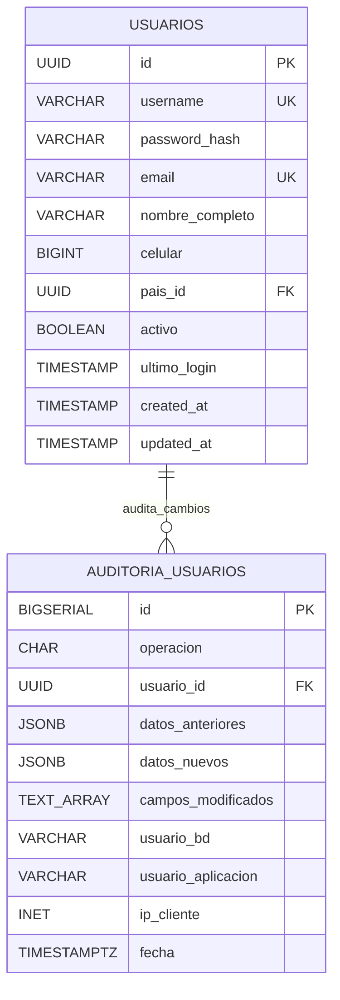
```mermaid
erDiagram
    USUARIOS {
        UUID id PK
        VARCHAR username UK
        VARCHAR password_hash
        VARCHAR email UK
        VARCHAR nombre_completo
        BIGINT celular
        UUID pais_id FK
        BOOLEAN activo
        TIMESTAMP ultimo_login
        TIMESTAMP created_at
        TIMESTAMP updated_at
    }
    AUDITORIA_USUARIOS {
        BIGSERIAL id PK
        CHAR operacion
        UUID usuario_id FK
        JSONB datos_anteriores
        JSONB datos_nuevos
        TEXT_ARRAY campos_modificados
        VARCHAR usuario_bd
        VARCHAR usuario_aplicacion
        INET ip_cliente
        TIMESTAMPTZ fecha
    }
    USUARIOS ||--o{ AUDITORIA_USUARIOS : audita_cambios
```

### Relaciones Clave

| Origen      | Destino            | Tipo | Descripción                                                                     |
| ----------- | ------------------ | ---- | ------------------------------------------------------------------------------- |
| usuarios    | usuario_roles      | 1:N  | Un usuario tiene varios roles                                                   |
| roles       | usuario_roles      | 1:N  | Un rol pertenece a varios usuarios                                              |
| usuarios    | paises             | N:1  | Un usuario pertenece a un país                                                  |
| paises      | monedas            | N:1  | Un país tiene una moneda oficial                                                |
| paises      | usuarios           | 1:N  | Un país puede tener varios usuarios                                             |
| usuarios    | plataformas        | 1:N  | Un usuario registra varias plataformas                                          |
| monedas     | plataformas        | 1:N  | Una plataforma opera en una moneda                                              |
| plataformas | comisiones         | 1:N  | Una plataforma tiene estructura de comisiones                                   |
| monedas     | comisiones         | 1:N  | La comisión se cobra en una moneda                                              |
| usuarios    | transacciones      | 1:N  | Un usuario realiza varias transacciones                                         |
| plataformas | transacciones      | 1:N  | Una transacción se ejecuta en una plataforma                                    |
| monedas     | transacciones      | 1:N  | Una transacción se registra en una moneda                                       |
| usuarios    | calculos_hist      | 1:N  | Historial de cálculos por usuario                                               |
| usuarios    | auditoria_usuarios | 1:N  | Un usuario genera múltiples registros de auditoría (INSERT/UPDATE/DELETE/Login) |

Se incluyen 54 divisas internacionales organizadas por región: principales (USD, COP, EUR, GBP), Américas (16), Europa (11), Asia-Pacífico (14) y Medio Oriente/África (9). Cada moneda tiene código ISO de 3 letras, nombre, símbolo y país asociado.

### Funciones PL/pgSQL Disponibles

| Función                   | Descripción                                   |
| ------------------------- | --------------------------------------------- |
| `obtener_comision_actual` | Retorna la comisión vigente de una plataforma |
| `calcular_comision`       | Calcula la comisión total para un monto dado  |
| `resumen_inversiones`     | Retorna las posiciones actuales por símbolo   |
| `calcular_venta_optima`   | Calcula precio mínimo para ganancia deseada   |

> Las funciones reciben y retornan UUIDs. Ver `database/sql/02_functions.sql` para detalles de parámetros.

### Auditoría de usuarios

El vínculo lógico `USUARIOS ||--o{ AUDITORIA_USUARIOS` representa la relación funcional: cada cambio en una fila de `usuarios` produce un registro en `auditoria_usuarios`. La escritura es **automática** vía el trigger `trg_audit_usuarios` (función `fn_audit_usuarios`, `SECURITY DEFINER`, owner `postgres`), que se dispara `AFTER INSERT OR UPDATE OR DELETE` `FOR EACH ROW`.

**Mapeo de operaciones registradas en `operacion`**:

- `I` → INSERT en `usuarios`
- `L` → UPDATE donde el único campo de negocio modificado es `ultimo_login` (login)
- `U` → UPDATE con cualquier otro campo de negocio
- `D` → DELETE en `usuarios`

La columna `updated_at` (metadato del sistema, actualizado por `@PreUpdate` en la entidad JPA) se **excluye** del cálculo de `campos_modificados` para que el login —que también toca `updated_at`— se registre correctamente como `L` y no como `U`.

Cada registro guarda:

- **Snapshots JSONB** de la fila antes y después del cambio (`datos_anteriores`, `datos_nuevos`).
- **Lista de columnas de negocio** modificadas en un UPDATE (`campos_modificados`).
- **`usuario_bd`**: `SESSION_USER` de PostgreSQL que ejecutó el DML (ej: `investment_app`).
- **`usuario_aplicacion`**: usuario autenticado vía JWT que originó la petición; `'desconocido'` si no hay autenticación.
- **`ip_cliente`**: IP del cliente PostgreSQL (`inet_client_addr()`).

**Propagación del usuario autenticado**: el backend envuelve el `DataSource` con `AuditUserAwareDataSource`, que lee `SecurityContextHolder` (poblado por `JwtAuthFilter` a partir del JWT) y ejecuta `set_config('app.audit_user', <username>, false)` en cada préstamo de conexión. El trigger consume ese valor con `current_setting('app.audit_user', true)`. Durante el login —cuando aún no hay JWT emitido— `LoginService` invoca `AuditContextService.setCurrentUser(username)` antes del `UPDATE` para forzar el username real en lugar de `'desconocido'`.

**Permisos**: `investment_app` (usuario de BD del backend) no tiene ningún privilegio sobre `auditoria_usuarios` ni sobre su secuencia. El trigger corre con permisos del owner (`postgres`) gracias a `SECURITY DEFINER`, de modo que la aplicación puede seguir modificando `usuarios` sin poder leer, alterar ni borrar la bitácora.

### Datos de Prueba

- **3 usuarios**: demo_user, admin, incognito (con roles USER, ADMIN y PREMIUM). Cada usuario tiene asignado un país (Colombia para demo_user e incognito, USA para admin) y un número de celular (numérico).
- **5 plataformas**: eToro, Interactive Brokers, Robinhood, Binance (USD) y Trii (COP).
- **11 transacciones** de ejemplo en USD y COP con fechas en UTC.
- **54 divisas internacionales** elegidas por las más destacadas de cada continente.
- **55 `paises`**: registros (uno por cada país de las monedas), con código ISO, indicativo celular y relación con la moneda correspondiente.
- **Índices de unicidad**: `username` y `email` son únicos case-insensitive, y `celular` es único a nivel de país (combinación `pais_id` + `celular`).

## 3. BACKEND - JAVA SPRING BOOT 3.x

### Servicios Publicados

#### 🔐 Seguridad

Servicios criptográficos de uso administrativo.

| Endpoint                  | Método | Auth  | Descripción                        |
| ------------------------- | ------ | ----- | ---------------------------------- |
| `/api/encryption/encrypt` | POST   | ADMIN | Encriptar texto con AES-256-GCM    |
| `/api/encryption/decrypt` | POST   | ADMIN | Desencriptar texto con AES-256-GCM |

#### 🔑 Login

Autenticación, renovación de sesión y cierre de sesión.

| Endpoint                  | Método | Auth                   | Descripción                                                |
| ------------------------- | ------ | ---------------------- | ---------------------------------------------------------- |
| `/api/auth/login`         | POST   | No                     | Login - Retorna **solo** `token` y `refreshToken`          |
| `/api/auth/refresh-token` | POST   | No (usa refresh token) | Renueva el access token - Retorna `token` y `refreshToken` |
| `/api/auth/logout`        | POST   | JWT                    | Cerrar sesión - invalida el token y el refresh token       |

#### 👤 Usuarios

Registro, recuperación, cambio de contraseña y gestión del perfil propio.

| Endpoint                      | Método | Auth              | Descripción                                                              |
| ----------------------------- | ------ | ----------------- | ------------------------------------------------------------------------ |
| `/api/auth/register/request`  | POST   | No                | Solicitar registro - envía token 6 dígitos por email                     |
| `/api/auth/register/confirm`  | POST   | No                | Confirmar registro con token y crear usuario                             |
| `/api/auth/recovery/request`  | POST   | No                | Solicitar recuperación - envía token 6 dígitos por email                 |
| `/api/auth/recovery/verify`   | POST   | No                | Verificar token y cambiar contraseña                                     |
| `/api/auth/change-my-pass`    | POST   | JWT               | Cambiar contraseña propia con validación actual                          |
| `/api/auth/restart-password`  | POST   | ADMIN             | Restablecer contraseña de cualquier usuario                              |
| `/api/auth/delete-account`    | POST   | JWT (propietario) | Borrado lógico de la cuenta (`activo = false`)                           |
| `/api/auth/get-my-profile`    | GET    | JWT               | Obtener el perfil del usuario autenticado (datos reales)                 |
| `/api/auth/update-my-profile` | POST   | JWT (propietario) | Actualizar perfil propio: `email`, `nombreCompleto`, `paisId`, `celular` |

#### 💼 Negocio

**Endpoints planificados** (aún no implementados). Se documentarán cuando se construyan las features asociadas.

| Endpoint esperado               | Método | Auth        | Descripción                                          |
| ------------------------------- | ------ | ----------- | ---------------------------------------------------- |
| `/api/plataformas`              | GET    | JWT         | Listar plataformas del usuario autenticado           |
| `/api/plataformas`              | POST   | JWT         | Registrar una nueva plataforma                       |
| `/api/plataformas/{id}`         | PUT    | JWT (dueño) | Actualizar una plataforma                            |
| `/api/plataformas/{id}`         | DELETE | JWT (dueño) | Borrado lógico de una plataforma                     |
| `/api/comisiones`               | GET    | JWT         | Consultar comisiones vigentes por plataforma         |
| `/api/transacciones`            | GET    | JWT         | Listar transacciones del usuario (con filtros)       |
| `/api/transacciones`            | POST   | JWT         | Registrar compra/venta de acciones                   |
| `/api/transacciones/{id}`       | GET    | JWT (dueño) | Detalle de una transacción                           |
| `/api/transacciones/resumen`    | GET    | JWT         | Resumen de posiciones actuales por símbolo           |
| `/api/calculadora/venta-optima` | POST   | JWT/PREMIUM | Calcular precio mínimo y cantidad óptima de venta    |
| `/api/calculadora/historial`    | GET    | JWT         | Historial de cálculos de venta óptima                |
| `/api/dashboard/resumen`        | GET    | JWT         | Total de movimientos y resultado (positivo/negativo) |

> Los endpoints de negocio implementarán las funciones PL/pgSQL `obtener_comision_actual`, `calcular_comision`, `resumen_inversiones` y `calcular_venta_optima` documentadas en [Funciones PL/pgSQL Disponibles](#funciones-plpgsql-disponibles).

#### 🧪 Sistema / Utilidades

Endpoints de diagnóstico y pruebas (no para producción).

| Endpoint                           | Método | Auth                 | Descripción                                |
| ---------------------------------- | ------ | -------------------- | ------------------------------------------ |
| `/api/test/health`                 | GET    | No                   | Health check del servicio                  |
| `/api/test/delete-user/{username}` | DELETE | ADMIN (solo pruebas) | Borrado definitivo en cascada para pruebas |

### Diagrama de secuencia de Los Servicios publicados:

#### Login

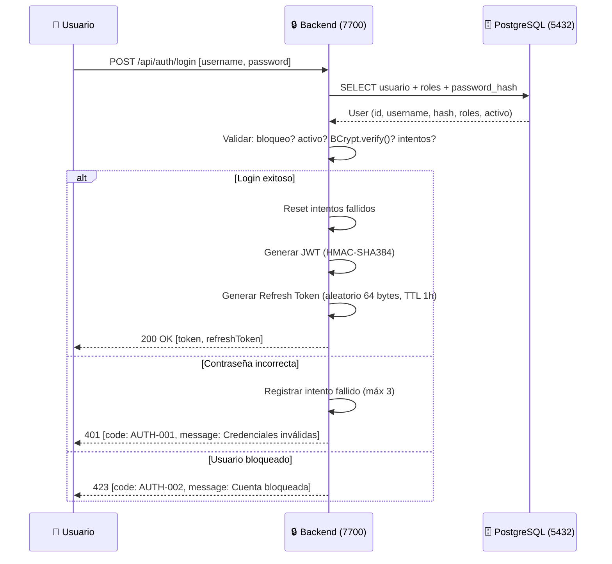
```mermaid
sequenceDiagram
    participant U as 👤 Usuario
    participant B as 🔒 Backend (7700)
    participant DB as 🗄️ PostgreSQL (5432)

    U->>B: POST /api/auth/login [username, password]
    B->>DB: SELECT usuario + roles + password_hash
    DB-->>B: User (id, username, hash, roles, activo)
    B->>B: Validar: bloqueo? activo? BCrypt.verify()? intentos?
    alt Login exitoso
        B->>B: Reset intentos fallidos
        B->>B: Generar JWT (HMAC-SHA384)
        B->>B: Generar Refresh Token (aleatorio 64 bytes, TTL 1h)
        B-->>U: 200 OK [token, refreshToken]
    else Contraseña incorrecta
        B->>B: Registrar intento fallido (máx 3)
        B-->>U: 401 [code: AUTH-001, message: Credenciales inválidas]
    else Usuario bloqueado
        B-->>U: 423 [code: AUTH-002, message: Cuenta bloqueada]
    end
```

> **Nota**: la respuesta del login solo contiene `token` y `refreshToken`. Los datos personales se consultan por separado en `/api/auth/get-my-profile`.

#### Restart Password (solo ADMIN)

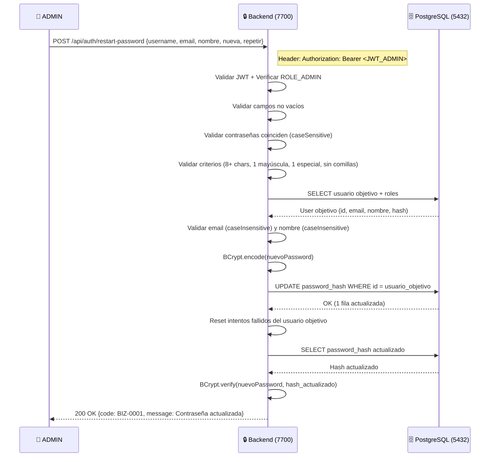
```mermaid
sequenceDiagram
    participant A as 👑 ADMIN
    participant B as 🔒 Backend (7700)
    participant DB as 🗄️ PostgreSQL (5432)

    A->>B: POST /api/auth/restart-password {username, email, nombre, nueva, repetir}
    Note right of B: Header: Authorization: Bearer <JWT_ADMIN>
    B->>B: Validar JWT + Verificar ROLE_ADMIN
    B->>B: Validar campos no vacíos
    B->>B: Validar contraseñas coinciden (caseSensitive)
    B->>B: Validar criterios (8+ chars, 1 mayúscula, 1 especial, sin comillas)
    B->>DB: SELECT usuario objetivo + roles
    DB-->>B: User objetivo (id, email, nombre, hash)
    B->>B: Validar email (caseInsensitive) y nombre (caseInsensitive)
    B->>B: BCrypt.encode(nuevoPassword)
    B->>DB: UPDATE password_hash WHERE id = usuario_objetivo
    DB-->>B: OK (1 fila actualizada)
    B->>B: Reset intentos fallidos del usuario objetivo
    B->>DB: SELECT password_hash actualizado
    DB-->>B: Hash actualizado
    B->>B: BCrypt.verify(nuevoPassword, hash_actualizado)
    B-->>A: 200 OK {code: BIZ-0001, message: Contraseña actualizada}
```

#### Encriptar Texto (ADMIN)

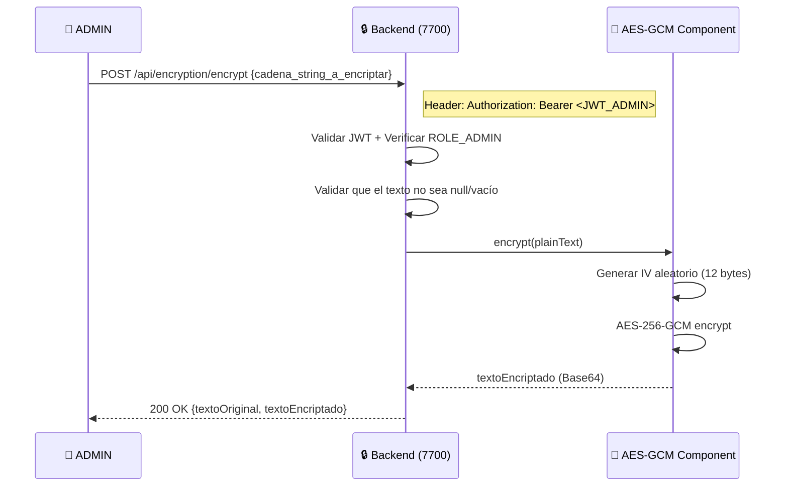
```mermaid
sequenceDiagram
    participant A as 👑 ADMIN
    participant B as 🔒 Backend (7700)
    participant E as 🔐 AES-GCM Component

    A->>B: POST /api/encryption/encrypt {cadena_string_a_encriptar}
    Note right of B: Header: Authorization: Bearer <JWT_ADMIN>
    B->>B: Validar JWT + Verificar ROLE_ADMIN
    B->>B: Validar que el texto no sea null/vacío
    B->>E: encrypt(plainText)
    E->>E: Generar IV aleatorio (12 bytes)
    E->>E: AES-256-GCM encrypt
    E-->>B: textoEncriptado (Base64)
    B-->>A: 200 OK {textoOriginal, textoEncriptado}
```

#### Desencriptar Texto (ADMIN)

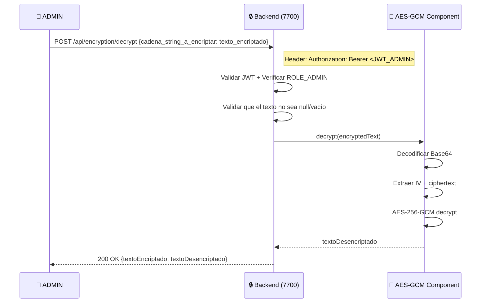
```mermaid
sequenceDiagram
    participant A as 👑 ADMIN
    participant B as 🔒 Backend (7700)
    participant E as 🔐 AES-GCM Component

    A->>B: POST /api/encryption/decrypt {cadena_string_a_encriptar: texto_encriptado}
    Note right of B: Header: Authorization: Bearer <JWT_ADMIN>
    B->>B: Validar JWT + Verificar ROLE_ADMIN
    B->>B: Validar que el texto no sea null/vacío
    B->>E: decrypt(encryptedText)
    E->>E: Decodificar Base64
    E->>E: Extraer IV + ciphertext
    E->>E: AES-256-GCM decrypt
    E-->>B: textoDesencriptado
    B-->>A: 200 OK {textoEncriptado, textoDesencriptado}
```

#### Logout (Cerrar Sesión)

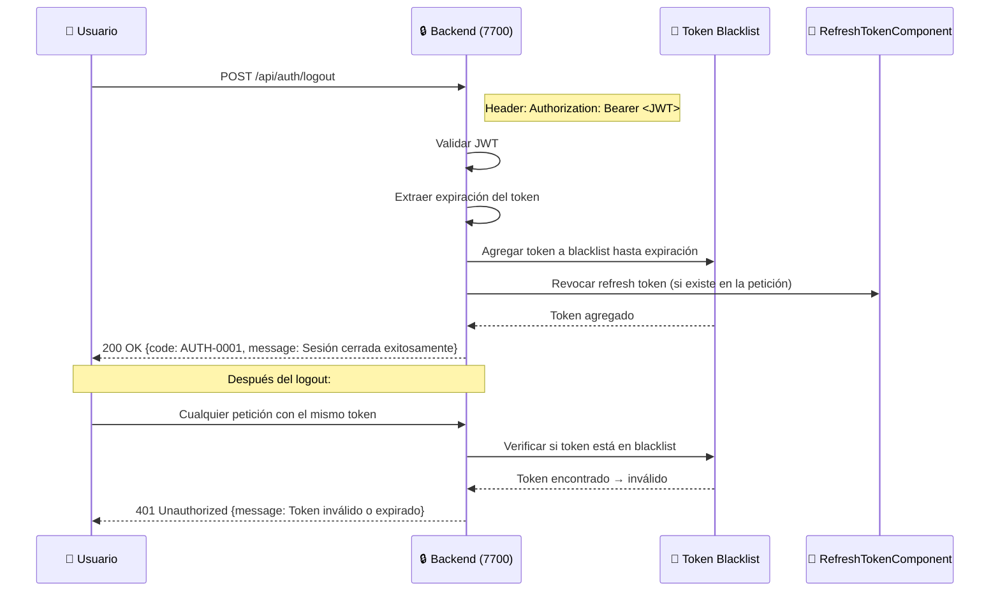
```mermaid
sequenceDiagram
    participant U as 👤 Usuario
    participant B as 🔒 Backend (7700)
    participant BL as 🚫 Token Blacklist
    participant RT as 🔄 RefreshTokenComponent

    U->>B: POST /api/auth/logout
    Note right of B: Header: Authorization: Bearer <JWT>
    B->>B: Validar JWT
    B->>B: Extraer expiración del token
    B->>BL: Agregar token a blacklist hasta expiración
    B->>RT: Revocar refresh token (si existe en la petición)
    BL-->>B: Token agregado
    B-->>U: 200 OK {code: AUTH-0001, message: Sesión cerrada exitosamente}

    Note over U,B: Después del logout:
    U->>B: Cualquier petición con el mismo token
    B->>BL: Verificar si token está en blacklist
    BL-->>B: Token encontrado → inválido
    B-->>U: 401 Unauthorized {message: Token inválido o expirado}
```

#### Recuperación de Contraseña (2FA SMTP)

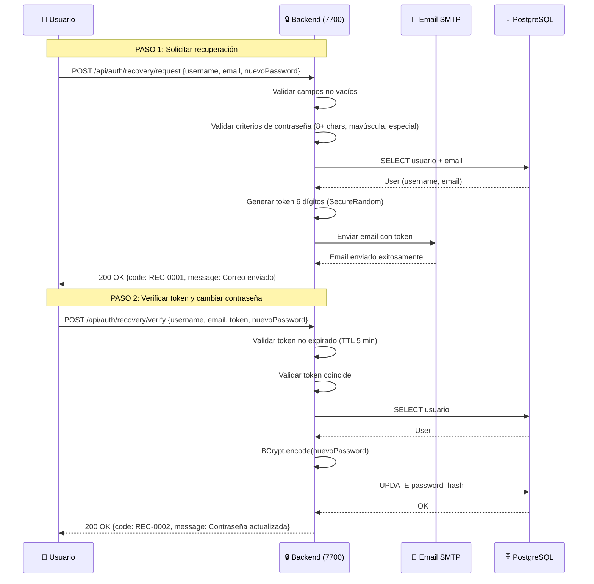
```mermaid
sequenceDiagram
    participant U as 👤 Usuario
    participant B as 🔒 Backend (7700)
    participant E as 📧 Email SMTP
    participant DB as 🗄️ PostgreSQL

    Note over U,B: PASO 1: Solicitar recuperación
    U->>B: POST /api/auth/recovery/request {username, email, nuevoPassword}
    B->>B: Validar campos no vacíos
    B->>B: Validar criterios de contraseña (8+ chars, mayúscula, especial)
    B->>DB: SELECT usuario + email
    DB-->>B: User (username, email)
    B->>B: Generar token 6 dígitos (SecureRandom)
    B->>E: Enviar email con token
    E-->>B: Email enviado exitosamente
    B-->>U: 200 OK {code: REC-0001, message: Correo enviado}

    Note over U,B: PASO 2: Verificar token y cambiar contraseña
    U->>B: POST /api/auth/recovery/verify {username, email, token, nuevoPassword}
    B->>B: Validar token no expirado (TTL 5 min)
    B->>B: Validar token coincide
    B->>DB: SELECT usuario
    DB-->>B: User
    B->>B: BCrypt.encode(nuevoPassword)
    B->>DB: UPDATE password_hash
    DB-->>B: OK
    B-->>U: 200 OK {code: REC-0002, message: Contraseña actualizada}
```

#### Refresh Token

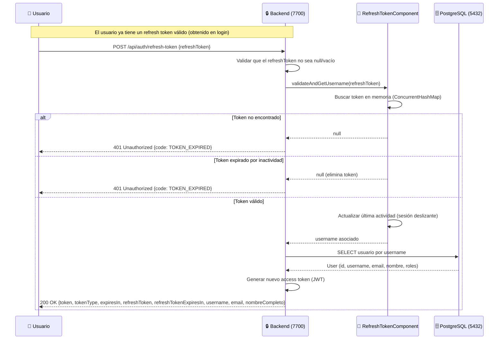
```mermaid
sequenceDiagram
    participant U as 👤 Usuario
    participant B as 🔒 Backend (7700)
    participant RT as 🔄 RefreshTokenComponent
    participant DB as 🗄️ PostgreSQL (5432)

    Note over U,B: El usuario ya tiene un refresh token válido (obtenido en login)

    U->>B: POST /api/auth/refresh-token {refreshToken}
    B->>B: Validar que el refreshToken no sea null/vacío
    B->>RT: validateAndGetUsername(refreshToken)
    RT->>RT: Buscar token en memoria (ConcurrentHashMap)
    alt Token no encontrado
        RT-->>B: null
        B-->>U: 401 Unauthorized {code: TOKEN_EXPIRED}
    else Token expirado por inactividad
        RT-->>B: null (elimina token)
        B-->>U: 401 Unauthorized {code: TOKEN_EXPIRED}
    else Token válido
        RT->>RT: Actualizar última actividad (sesión deslizante)
        RT-->>B: username asociado
        B->>DB: SELECT usuario por username
        DB-->>B: User (id, username, email, nombre, roles)
        B->>B: Generar nuevo access token (JWT)
        B-->>U: 200 OK {token, tokenType, expiresIn, refreshToken, refreshTokenExpiresIn, username, email, nombreCompleto}
    end
```

#### Change My Password

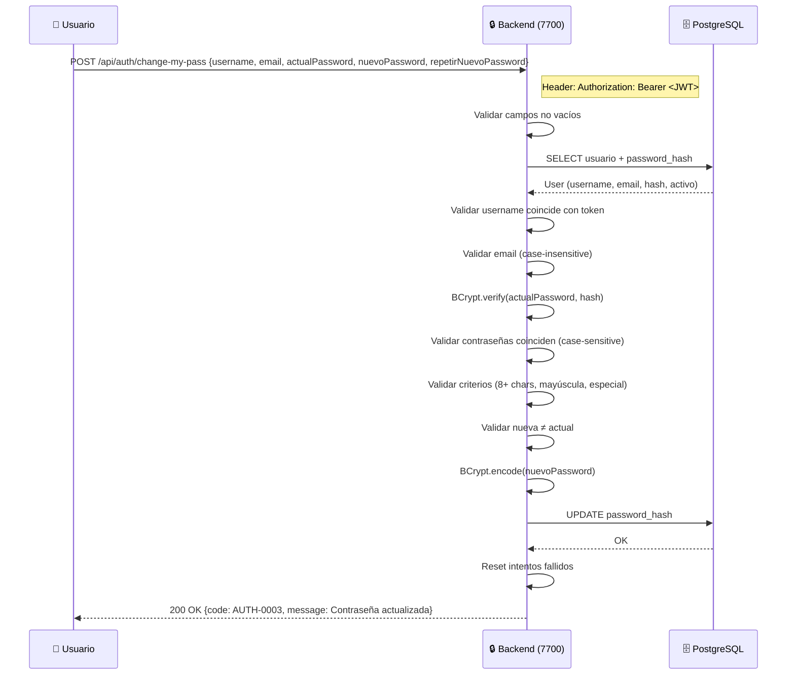
```mermaid
sequenceDiagram
    participant U as 👤 Usuario
    participant B as 🔒 Backend (7700)
    participant DB as 🗄️ PostgreSQL

    U->>B: POST /api/auth/change-my-pass {username, email, actualPassword, nuevoPassword, repetirNuevoPassword}
    Note right of B: Header: Authorization: Bearer <JWT>
    B->>B: Validar campos no vacíos
    B->>DB: SELECT usuario + password_hash
    DB-->>B: User (username, email, hash, activo)
    B->>B: Validar username coincide con token
    B->>B: Validar email (case-insensitive)
    B->>B: BCrypt.verify(actualPassword, hash)
    B->>B: Validar contraseñas coinciden (case-sensitive)
    B->>B: Validar criterios (8+ chars, mayúscula, especial)
    B->>B: Validar nueva ≠ actual
    B->>B: BCrypt.encode(nuevoPassword)
    B->>DB: UPDATE password_hash
    DB-->>B: OK
    B->>B: Reset intentos fallidos
    B-->>U: 200 OK {code: AUTH-0003, message: Contraseña actualizada}
```

#### Registro de Usuario

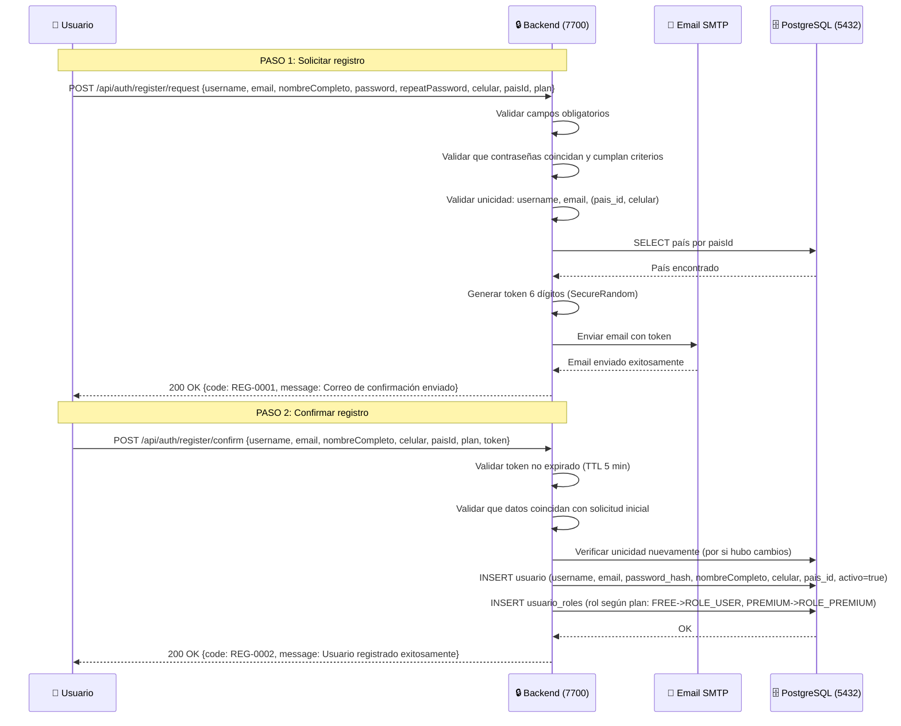
```mermaid
sequenceDiagram
    participant U as 👤 Usuario
    participant B as 🔒 Backend (7700)
    participant E as 📧 Email SMTP
    participant DB as 🗄️ PostgreSQL (5432)

    Note over U,B: PASO 1: Solicitar registro
    U->>B: POST /api/auth/register/request {username, email, nombreCompleto, password, repeatPassword, celular, paisId, plan}
    B->>B: Validar campos obligatorios
    B->>B: Validar que contraseñas coincidan y cumplan criterios
    B->>B: Validar unicidad: username, email, (pais_id, celular)
    B->>DB: SELECT país por paisId
    DB-->>B: País encontrado
    B->>B: Generar token 6 dígitos (SecureRandom)
    B->>E: Enviar email con token
    E-->>B: Email enviado exitosamente
    B-->>U: 200 OK {code: REG-0001, message: Correo de confirmación enviado}

    Note over U,B: PASO 2: Confirmar registro
    U->>B: POST /api/auth/register/confirm {username, email, nombreCompleto, celular, paisId, plan, token}
    B->>B: Validar token no expirado (TTL 5 min)
    B->>B: Validar que datos coincidan con solicitud inicial
    B->>DB: Verificar unicidad nuevamente (por si hubo cambios)
    B->>DB: INSERT usuario (username, email, password_hash, nombreCompleto, celular, pais_id, activo=true)
    B->>DB: INSERT usuario_roles (rol según plan: FREE->ROLE_USER, PREMIUM->ROLE_PREMIUM)
    DB-->>B: OK
    B-->>U: 200 OK {code: REG-0002, message: Usuario registrado exitosamente}
```

#### Borrado de Cuenta

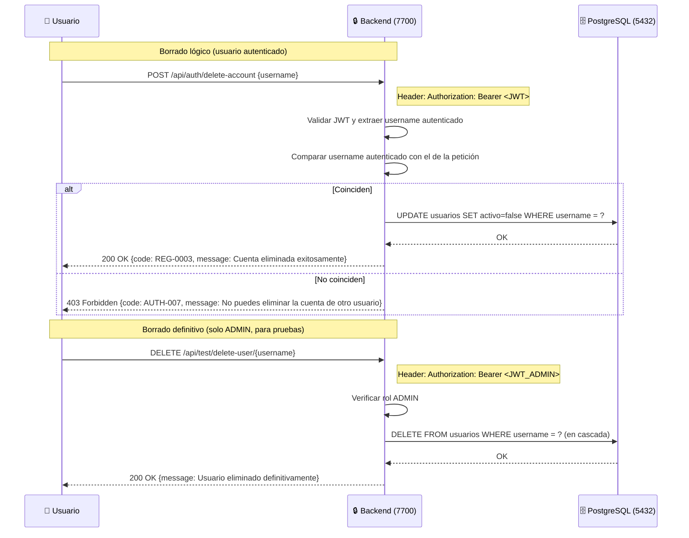
```mermaid
sequenceDiagram
    participant U as 👤 Usuario
    participant B as 🔒 Backend (7700)
    participant DB as 🗄️ PostgreSQL (5432)

    Note over U,B: Borrado lógico (usuario autenticado)
    U->>B: POST /api/auth/delete-account {username}
    Note right of B: Header: Authorization: Bearer <JWT>
    B->>B: Validar JWT y extraer username autenticado
    B->>B: Comparar username autenticado con el de la petición
    alt Coinciden
        B->>DB: UPDATE usuarios SET activo=false WHERE username = ?
        DB-->>B: OK
        B-->>U: 200 OK {code: REG-0003, message: Cuenta eliminada exitosamente}
    else No coinciden
        B-->>U: 403 Forbidden {code: AUTH-007, message: No puedes eliminar la cuenta de otro usuario}
    end

    Note over U,B: Borrado definitivo (solo ADMIN, para pruebas)
    U->>B: DELETE /api/test/delete-user/{username}
    Note right of B: Header: Authorization: Bearer <JWT_ADMIN>
    B->>B: Verificar rol ADMIN
    B->>DB: DELETE FROM usuarios WHERE username = ? (en cascada)
    DB-->>B: OK
    B-->>U: 200 OK {message: Usuario eliminado definitivamente}
```

#### Obtener Perfil Propio (GET)

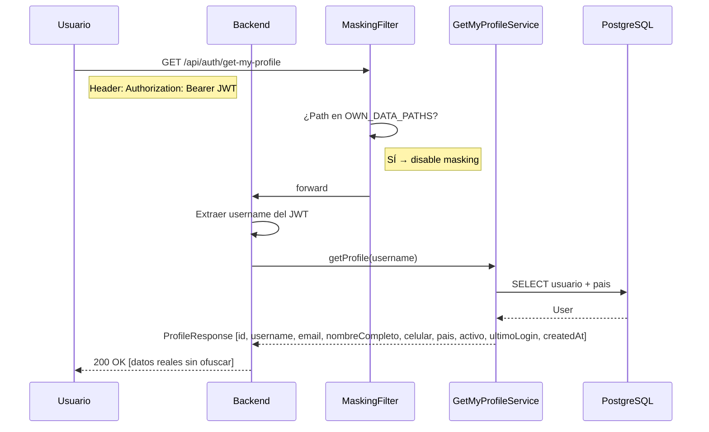
```mermaid
sequenceDiagram
    participant U as Usuario
    participant B as Backend
    participant F as MaskingFilter
    participant S as GetMyProfileService
    participant DB as PostgreSQL

    U->>F: GET /api/auth/get-my-profile
    Note right of U: Header: Authorization: Bearer JWT
    F->>F: ¿Path en OWN_DATA_PATHS?
    Note right of F: SÍ → disable masking
    F->>B: forward
    B->>B: Extraer username del JWT
    B->>S: getProfile(username)
    S->>DB: SELECT usuario + pais
    DB-->>S: User
    S-->>B: ProfileResponse [id, username, email, nombreCompleto, celular, pais, activo, ultimoLogin, createdAt]
    B-->>U: 200 OK [datos reales sin ofuscar]
```

#### Actualizar Perfil Propio (POST)

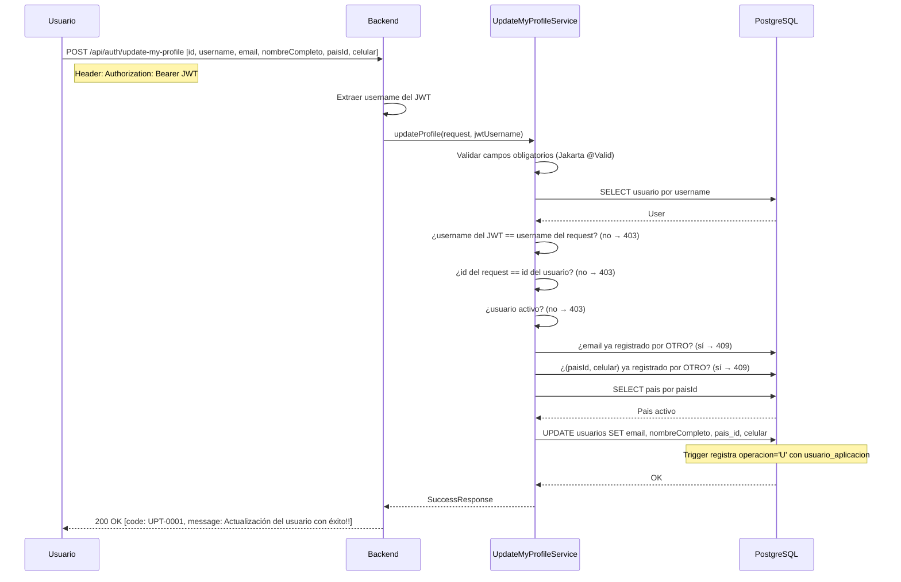
```mermaid
sequenceDiagram
    participant U as Usuario
    participant B as Backend
    participant S as UpdateMyProfileService
    participant DB as PostgreSQL

    U->>B: POST /api/auth/update-my-profile [id, username, email, nombreCompleto, paisId, celular]
    Note right of U: Header: Authorization: Bearer JWT
    B->>B: Extraer username del JWT
    B->>S: updateProfile(request, jwtUsername)
    S->>S: Validar campos obligatorios (Jakarta @Valid)
    S->>DB: SELECT usuario por username
    DB-->>S: User
    S->>S: ¿username del JWT == username del request? (no → 403)
    S->>S: ¿id del request == id del usuario? (no → 403)
    S->>S: ¿usuario activo? (no → 403)
    S->>DB: ¿email ya registrado por OTRO? (sí → 409)
    S->>DB: ¿(paisId, celular) ya registrado por OTRO? (sí → 409)
    S->>DB: SELECT pais por paisId
    DB-->>S: Pais activo
    S->>DB: UPDATE usuarios SET email, nombreCompleto, pais_id, celular
    Note over DB: Trigger registra operacion='U' con usuario_aplicacion
    DB-->>S: OK
    S-->>B: SuccessResponse
    B-->>U: 200 OK [code: UPT-0001, message: Actualización del usuario con éxito!!]
```

#### Ofuscación de salida (login enmascarado)

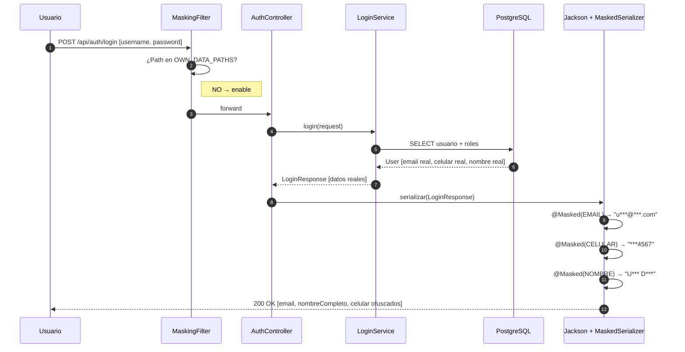
```mermaid
sequenceDiagram
    autonumber
    participant U as Usuario
    participant F as MaskingFilter
    participant C as AuthController
    participant S as LoginService
    participant DB as PostgreSQL
    participant J as Jackson + MaskedSerializer

    U->>F: POST /api/auth/login [username, password]
    F->>F: ¿Path en OWN_DATA_PATHS?
    Note right of F: NO → enable
    F->>C: forward
    C->>S: login(request)
    S->>DB: SELECT usuario + roles
    DB-->>S: User [email real, celular real, nombre real]
    S-->>C: LoginResponse [datos reales]
    C->>J: serializar(LoginResponse)
    J->>J: @Masked(EMAIL) → "u***@***.com"
    J->>J: @Masked(CELULAR) → "***4567"
    J->>J: @Masked(NOMBRE) → "U*** D***"
    J-->>U: 200 OK [email, nombreCompleto, celular ofuscados]
```

#### Endpoint de datos propios (sin ofuscar)

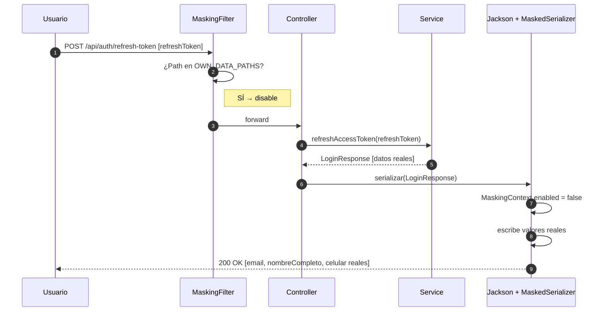
```mermaid
sequenceDiagram
    autonumber
    participant U as Usuario
    participant F as MaskingFilter
    participant C as Controller
    participant S as Service
    participant J as Jackson + MaskedSerializer

    U->>F: POST /api/auth/refresh-token [refreshToken]
    F->>F: ¿Path en OWN_DATA_PATHS?
    Note right of F: SÍ → disable
    F->>C: forward
    C->>S: refreshAccessToken(refreshToken)
    S-->>C: LoginResponse [datos reales]
    C->>J: serializar(LoginResponse)
    J->>J: MaskingContext.enabled = false
    J->>J: escribe valores reales
    J-->>U: 200 OK [email, nombreCompleto, celular reales]
```

### Seguridad

- **JWT** con firma HMAC-SHA384
- **AES-256-GCM** para encriptación bidireccional de datos sensibles
- **BCrypt** para hash de contraseñas
- **Roles**: ROLE_ADMIN, ROLE_USER, ROLE_PREMIUM
- Control de intentos fallidos: 3 intentos, bloqueo progresivo (5min → 15min → 30min → 1h → 12h → 24h → permanente)
- Validaciones de contraseña: 8+ caracteres, 1 mayúscula, 1 carácter especial, sin comillas
- Validación case-insensitive para email, case-sensitive para contraseñas
- **2FA SMTP** para recuperación de contraseña con token de 6 dígitos
- **Refresh Token**: Se genera un token adicional en el login, válido por 1 hora, que permite renovar el access token sin necesidad de reautenticación. La renovación se realiza mediante una sesión deslizante (cada uso extiende la expiración 1 hora más). Los refresh tokens se almacenan en memoria (ConcurrentHashMap) y se invalidan al hacer logout o al expirar. La configuración completa (TTL, tiempos, etc.) se gestiona en el archivo application.yml bajo la clave refresh-token.
- **Auditoría de usuarios**: tabla `auditoria_usuarios` con trigger `trg_audit_usuarios` (función `fn_audit_usuarios`, `SECURITY DEFINER`, owner `postgres`). Registra INSERT/UPDATE/DELETE y Login (`operacion='L'`) con snapshots JSONB y campos modificados. Excluye `updated_at` de los campos de negocio.
- **Usuario de BD de la aplicación**: `investment_app` con permisos DML (SELECT/INSERT/UPDATE/DELETE) sobre las tablas de negocio, **sin acceso** a `auditoria_usuarios` ni a su secuencia. Configurado en `150_permisos/00_001_000_01_cr_app_db_user.sql`. El backend en `application.yml` usa `investment_app` (credenciales AES-256-GCM).
- **Propagación del usuario autenticado**: `AuditUserAwareDataSource` (wrapper del `DataSource`) lee `SecurityContextHolder` y ejecuta `set_config('app.audit_user', <username>, false)` en cada `getConnection()`. El valor es consumido por el trigger de auditoría. `AuditContextService.setCurrentUser(username)` (con `Propagation.MANDATORY`) permite forzar el usuario durante el login, antes de que el JWT sea emitido.
- **Registro de usuarios**: proceso en dos pasos con confirmación por email (token de 6 dígitos, TTL 5 min). Validación de unicidad de `username`, `email` y `(pais_id, celular)`. Asignación de rol según plan (`FREE` → `ROLE_USER`, `PREMIUM` → `ROLE_PREMIUM`).
- **Borrado de cuenta**: lógico (cambia `activo` a `false`) solo para el propio usuario autenticado. Existe un endpoint adicional de borrado definitivo en cascada para pruebas (solo ADMIN).
- **Login minimalista**: el endpoint `/api/auth/login` retorna **únicamente** `token` y `refreshToken`.
- **Consultar datos personales** del usuario JWT en el endpoint `/api/auth/get-my-profile`.
- **Actualización de perfil propio**: `/api/auth/update-my-profile` solo permite actualizar el **propio** usuario. Valida que el `username` e `id` del request coincidan con el JWT. Campos editables: `email`, `nombreCompleto`, `paisId`, `celular`. El email y `nombreCompleto` se guardan **tal cual** los envía el usuario (solo trim), preservando mayúsculas/minúsculas.
- **Unicidad case-insensitive**: tanto el registro como la actualización comparan email con `equalsIgnoreCase` y `findByEmailIgnoreCase`, pero el valor **almacenado** conserva el case original del usuario.

### Perfil de Usuario

Servicios para que el usuario autenticado consulte y modifique **su propio** perfil. Solo operan sobre el usuario autenticado vía JWT; no permiten leer ni modificar datos de terceros.

#### Reglas de negocio

1. **Solo el propio usuario**: el `username` del request debe coincidir con el del JWT. Adicionalmente, el `id` del request debe coincidir con el `id` del usuario autenticado.
2. **Campos editables**: `email`, `nombreCompleto`, `paisId`, `celular`.
3. **Campos NO editables**: `username`, `password_hash`, `activo`, `roles`, `id`, `ultimo_login`.
4. **Todos los campos son obligatorios**: el `UpdateMyProfileRequest` usa `@NotNull`/`@NotBlank` en todos sus campos.
5. **Unicidad case-insensitive**: se valida que `email` y `(pais_id, celular)` no estén en uso por OTRO usuario. La comparación es case-insensitive (`equalsIgnoreCase` + `findByEmailIgnoreCase`) pero el valor **se guarda tal cual** lo envía el usuario (solo `trim`), preservando mayúsculas/minúsculas.
6. **País debe existir y estar activo**.
7. **Auditoría automática**: el trigger `trg_audit_usuarios` registra el UPDATE con `operacion='U'` y `usuario_aplicacion=<username del JWT>`.

#### Respuesta de éxito (update)

```json
{
  "code": "UPT-0001",
  "message": "Actualización del usuario con éxito!!",
  "timestamp": "2026-09-19T16:24:32.252"
}
```

#### Códigos de error relevantes

| Situación                         | Código                | HTTP |
| --------------------------------- | --------------------- | ---- |
| Campos vacíos (Jakarta `@Valid`)  | `SYS-03`              | 500  |
| `username`/`id` ajenos            | `AUTH-007`            | 403  |
| Email ya registrado por otro      | `REG-002`             | 409  |
| `(paisId, celular)` ya registrado | `REG-003`             | 409  |
| País inexistente o inactivo       | `REG-007`             | 404  |
| Usuario no encontrado             | `BIZ-001`             | 404  |
| Sin JWT (Spring Security)         | _(formato Spring)_    | 403  |
| JWT inválido o expirado           | `AUTH-005`/`AUTH-006` | 401  |

#### Modelos

- **Request (`UpdateMyProfileRequest`)**: `id` (UUID), `username` (String), `email` (String), `nombreCompleto` (String), `paisId` (UUID), `celular` (Long). Todos obligatorios.
- **Response GET (`ProfileResponse`)**: `id`, `username`, `email`, `nombreCompleto`, `celular`, `pais` (PaisDTO), `activo`, `ultimoLogin`, `createdAt`.
- **Response POST (update)**: `SuccessResponse` con `code = UPT-0001`.

#### Ofuscación

- `/api/auth/get-my-profile` está en `OWN_DATA_PATHS` del `MaskingFilter` → devuelve datos **reales** al dueño (email, `nombreCompleto`, `celular` sin enmascarar).
- `/api/auth/login` y `/api/auth/refresh-token` **no retornan datos personales** (solo `token` y `refreshToken`).
- El resto de endpoints aplica la máscara por defecto según `MaskType`.

### Ofuscación de datos sensibles

Capa transversal del backend que enmascara campos sensibles **a la salida** (serialización JSON), evitando que viajen en claro por la red o aparezcan en logs. Los servicios y validaciones internas siguen operando con datos **reales**, por lo que flujos como login, recovery y change-password no se ven afectados.

#### Componentes

| Componente                      | Rol                                                                            |
| ------------------------------- | ------------------------------------------------------------------------------ |
| `MaskType` (enum)               | Tipos soportados: `EMAIL`, `CELULAR`, `NOMBRE`. Extensible.                    |
| `@Masked(MaskType)`             | Anotación que marca un campo de un DTO como sensible.                          |
| `DataMasking`                   | Utilidad estática con las reglas de ofuscación. Sin estado.                    |
| `MaskingContext`                | `ThreadLocal<Boolean>` que indica si la ofuscación está activa en la petición. |
| `MaskedSerializer`              | `JsonSerializer` que aplica la máscara respetando `MaskingContext`.            |
| `MaskingAnnotationIntrospector` | Introspector Jackson que conecta `@Masked` con `MaskedSerializer`.             |
| `MaskingFilter`                 | `OncePerRequestFilter` que activa/desactiva `MaskingContext` según el path.    |
| `JacksonMaskingConfig`          | Configuración Spring que registra el introspector.                             |

#### Formatos de ofuscación

| Tipo      | Ejemplo input            | Ejemplo output   |
| --------- | ------------------------ | ---------------- |
| `EMAIL`   | `user@test.com`          | `u***@***.com`   |
| `EMAIL`   | `maria.lopez@empresa.co` | `m***@***.co`    |
| `CELULAR` | `3001234567`             | `***4567`        |
| `NOMBRE`  | `Juan Pérez García`      | `J*** P*** G***` |

#### Decisión de diseño

- Endpoints en `OWN_DATA_PATHS` (por ejemplo `/api/auth/refresh-token`) devuelven datos reales del propio usuario.
- El resto de endpoints aplican la máscara por defecto.
- **Estado actual**:
  - `/api/auth/login` **no retorna datos personales** (solo `token` y `refreshToken`).
  - `/api/auth/refresh-token` **no retorna datos personales** (solo `token` y `refreshToken`).
  - `/api/auth/get-my-profile` está en `OWN_DATA_PATHS`
  - El resto de endpoints aplica la máscara por defecto.

#### Cómo extender

**Agregar un nuevo tipo de ofuscación**:

1. Agregar el tipo al enum `MaskType`.
2. Agregar su `case` en `DataMasking.mask`.
3. Anotar cualquier campo de un DTO con `@Masked(MaskType.NUEVO)`.
4. (Opcional) Registrar el campo en `application.yml → security.sensitive-fields` para evitar que aparezca en logs.

**Marcar un endpoint como "propio"** (sin ofuscar):

1. Agregar la ruta al `Set<String> OWN_DATA_PATHS` en `MaskingFilter`.
2. Documentar en el commit por qué el endpoint devuelve datos sin enmascarar.

**Que TODAS las respuestas ofusquen**:

1. Vaciar el `Set<String> OWN_DATA_PATHS` en `MaskingFilter`.

#### Filtro de logs sensibles

- `SensitiveFieldsProperties` lee `security.sensitive-fields` desde `application.yml`.
- `LogSanitizer.sanitize(field, value)` devuelve `[PROTEGIDO]` si el campo está en la lista negra.
- Campos configurables actuales:

```yaml
security:
  sensitive-fields:
    - email
    - celular
    - nombre_completo
    - password
    - password_hash
    - passwordHash
    - token
    - refreshToken
    - actualPassword
    - nuevoPassword
    - repetirNuevoPassword
```

**Uso**:

```java
log.debug("Usuario {} - Email: {}", username, logSanitizer.sanitize("email", user.getEmail()));
// → "Usuario admin - Email: [PROTEGIDO]"
```

La lista se puede modificar sin recompilar, solo reiniciando el backend.

### Códigos de Error

El backend utiliza un esquema de códigos agrupados por dominio. Se devuelven en el campo `code` de `ErrorResponse`.

#### Códigos por dominio

| Prefijo  | Dominio                               | Ejemplos                                                                                 |
| -------- | ------------------------------------- | ---------------------------------------------------------------------------------------- |
| `AUTH-*` | Autenticación y autorización          | `AUTH-001` credenciales inválidas, `AUTH-007` acceso denegado, `AUTH-008` no autenticado |
| `REG-*`  | Registro y unicidad                   | `REG-001` username existe, `REG-002` email existe, `REG-007` país no encontrado          |
| `REC-*`  | Recuperación de contraseña (2FA SMTP) | `REC-001` intentos excedidos, `REC-004` usuario no coincide                              |
| `PWD-*`  | Contraseña                            | `PWD-001` no coinciden, `PWD-002` no cumple criterios, `PWD-003` actual incorrecta       |
| `VAL-*`  | Validaciones de negocio               | `VAL-001` error de validación, `VAL-005` campos vacíos                                   |
| `ENC-*`  | Encriptación AES-GCM                  | `ENC-001` error al encriptar, `ENC-003` texto null/vacío                                 |
| `BIZ-*`  | Reglas de negocio                     | `BIZ-001` usuario no encontrado, `BIZ-002` plataforma no encontrada                      |
| `RATE-*` | Rate limiting                         | `RATE-001` demasiadas peticiones                                                         |
| `SYS-*`  | Errores internos y sistema            | `SYS-001` error interno, `SYS-02` error de conexión, `SYS-03` argumentos inválidos       |

#### Cambio destacado: `SYS-03` — Argumentos Inválidos

A partir de la fecha de esta versión, los errores de **Jakarta Bean Validation** (`@Valid` en el controller, disparados por `@NotNull`, `@NotBlank`, `@Size`, etc.) se reportan con el código `SYS-03` y HTTP **500**:

```json
{
  "code": "SYS-03",
  "message": "Argumentos invalidos",
  "timestamp": "2026-09-19T16:24:32.252383273"
}
```

**Motivación**: no exponer al cliente detalles internos sobre qué campos específicos fallaron. El detalle **sí** se registra en logs del backend con `log.warn("Validación fallida: {}", details)`.

**Distinción importante**:

| Tipo de error                                          | Código                   | HTTP | Detalle en la respuesta |
| ------------------------------------------------------ | ------------------------ | ---- | ----------------------- |
| Validación Jakarta (`@Valid`, `@NotBlank`, `@NotNull`) | `SYS-03`                 | 500  | ❌ No expone detalle    |
| Validación de negocio (servicio)                       | `PWD-*`, `VAL-005`, etc. | 400  | ✅ Mensaje específico   |

**Ejemplos**:

- `POST /api/auth/update-my-profile` con campos vacíos → `SYS-03` (500)
- `POST /api/auth/restart-password` con passwords que no coinciden → `PWD-001` (400)
- `POST /api/auth/change-my-pass` con password muy corta → `SYS-03` (500, disparado por `@Size`)
- `POST /api/auth/login` con usuario bloqueado → `AUTH-002` (423)

### Pruebas

- **100 pruebas automatizadas** (integración + unitarias)

- Cobertura: login, restart-password, change-my-password, recuperación 2FA SMTP, encriptación AES-GCM, control de roles, bloqueos, refresh token, registro de usuario, borrado de cuenta, auditoría de usuarios, perfil propio (get/update).

- Ejecutar todas: `mvn test`

- Ejecutar suite específica: `mvn test -Dtest=NombreDeLaSuite`

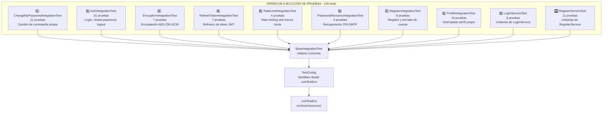
```mermaid
graph TB
    subgraph "ORDEN DE EJECUCIÓN DE PRUEBAS - 100 tests"
        A["1️⃣ ChangeMyPasswordIntegrationTest<br/>11 pruebas<br/>Cambio de contraseña propia"]
        B["2️⃣ AuthIntegrationTest<br/>31 pruebas<br/>Login, restart-password, logout"]
        C["3️⃣ EncryptionIntegrationTest<br/>7 pruebas<br/>Encriptación AES-256-GCM"]
        D["4️⃣ RefreshTokenIntegrationTest<br/>7 pruebas<br/>Refresco de token JWT"]
        E["5️⃣ RateLimitIntegrationTest<br/>4 pruebas<br/>Rate limiting anti fuerza bruta"]
        F["6️⃣ PasswordRecoveryIntegrationTest<br/>4 pruebas<br/>Recuperación 2FA SMTP"]
        G["7️⃣ RegisterIntegrationTest<br/>8 pruebas<br/>Registro y borrado de cuenta"]
        H["8️⃣ ProfileIntegrationTest<br/>10 pruebas<br/>Get/Update perfil propio"]
        I["9️⃣ LoginServiceTest<br/>6 pruebas<br/>Unitarias de LoginService"]
        J["🔟 RegisterServiceTest<br/>11 pruebas<br/>Unitarias de RegisterService"]
    end

    A --> K["BaseIntegrationTest<br/>Helpers comunes"]
    B --> K
    C --> K
    D --> K
    E --> K
    F --> K
    G --> K
    H --> K
    I --> K
    J --> K

    K --> L["TestConfig<br/>Variables desde .unitTestEnv"]
    L --> M[".unitTestEnv<br/>src/test/resources/"]
```

**Arquitectura de pruebas:**

- `.unitTestEnv`: archivo de configuración con todos los datos de prueba (usuarios, contraseñas, URLs) ubicado en `src/test/resources/`

- `BaseIntegrationTest`: helpers comunes (`loginAndGetToken`, `toJson`, `printBanner`, `clearBlacklist`).  
  **Nota:** En el método `clearBlacklist()` (ejecutado en `@BeforeEach`) se limpian la blacklist de tokens JWT y el rate limiter, pero **no** se limpian los refresh tokens. Esto es intencional para permitir que las pruebas de `RefreshTokenIntegrationTest` generen un refresh token en una prueba y lo reutilicen en pruebas posteriores dentro de la misma suite.

- `TestConfig`: variables centralizadas desde `.unitTestEnv`

- `ProfileIntegrationTest`: usa @BeforeAll para obtener el token y el id real de demo_user (vía GET /api/auth/get-my-profile). Restaura el nombreCompleto original al final de cada test que lo modifica.

- `@BeforeEach`: se utiliza en la mayoría de las pruebas para obtener un token fresco (login) antes de cada test, garantizando independencia total entre ellos.  
  **Excepciones:**
  - **`ChangeMyPasswordIntegrationTest`**: No usa `@BeforeEach` para obtener tokens, ya que al cambiar la contraseña del usuario `demo_user` en la prueba 2, el login posterior con la contraseña antigua fallaría y bloquearía al usuario. En su lugar, se usa `@BeforeAll` (ver más abajo).
  - **`RefreshTokenIntegrationTest`**: No usa `@BeforeEach` porque necesita que el refresh token generado en la prueba 1 persista hasta la prueba 2 (no se debe limpiar entre pruebas). La limpieza automática de refresh tokens está deshabilitada en `BaseIntegrationTest`.

- `@AfterEach`: se utiliza en algunas pruebas para limpiar estados o restaurar datos después de cada test.  
  **Excepción:** En `ChangeMyPasswordIntegrationTest` no se usa `@AfterEach`, ya que la restauración de la contraseña original se realiza explícitamente en la última prueba (CMP-11) utilizando un token de administrador.

- `@BeforeAll`: se usa **únicamente** en `ChangeMyPasswordIntegrationTest` para obtener los tokens de `demo_user` y `admin` una sola vez antes de todas las pruebas de esa clase. Esto evita que el cambio de contraseña afecte a los logins posteriores y previene el bloqueo del usuario por intentos fallidos.  
  El comentario asociado en el código es el siguiente:

```java
/**
 * Importante NUNCA se debe usar @BeforeEach ni @AfterEach para obtener tokens,
 * ya que se reinicia el estado de la base de datos y se invalidan los tokens.
 * Por eso se usa @BeforeAll para obtener los tokens una sola vez antes de todas
 * las pruebas.
 *
 * @throws Exception
 */
```

## 100. Servicios Docker

### Servicios

| Servicio    | Puerto | URL                   |
| ----------- | ------ | --------------------- |
| PostgreSQL  | 5432   | localhost:5432        |
| pgAdmin     | 5050   | http://localhost:5050 |
| Backend     | 7700   | http://localhost:7700 |
| Frontend    | 3000   | http://localhost:3000 |
| Nginx HTTPS | 443    | https://localhost     |

```
┌──────────────────────────────────────────────────────────────┐
│                  DOCKER COMPOSE NETWORK                       │
│                  investment_network (bridge)                  │
│                                                              │
│  ┌──────────────────┐  ┌──────────────────┐                 │
│  │  investment-db    │  │ investment-backend│                │
│  │  postgres:16-alp  │  │ spring-boot:3.x  │                 │
│  │  :5432 → :5432    │◄─┤ :7700 → :7700    │                 │
│  │  volume: data     │  │ JWT + BCrypt     │                 │
│  └──────────────────┘  └──────────────────┘                 │
│                                                              │
│  ┌──────────────────┐  ┌──────────────────┐                 │
│  │ investment-pgadmin│  │ investment-nginx  │                 │
│  │ pgadmin4:latest   │  │ nginx:alpine     │                 │
│  │ :5050 → :80       │  │ :80, :443        │                 │
│  │ volume: pgadmin   │  │ SSL + proxy      │                 │
│  └──────────────────┘  └──────────────────┘                 │
└──────────────────────────────────────────────────────────────┘
```

### Scripts de Mantenimiento

#### Verificar sistema completo

./docker/shellTest/check-all.sh

#### Reset base de datos (mantiene configuración pgadmin)

./docker/shellTest/reset-all.sh

#### Reset solo pgadmin

./docker/shellTest/reset-pgadmin.sh

#### Backup base de datos

./docker/shellTest/backup-db.sh

#### Restaurar backup

./docker/shellTest/restore-db.sh <archivo.sql>

## 101. Estructura del Proyecto

#### Estructura detallada de archivos

- **`investment-tracker/`** - Raíz del proyecto
  - `.gitignore` - Archivos ignorados por Git
  - `LICENSE` - Licencia del proyecto
  - `README.md` - Documentación principal
  - **`.vscode/`**
    - `settings.json` - Configuración de VS Code
  - **`docker/`** - Contenedores y orquestación
    - `docker-compose.yml` - Orquestación de servicios
    - `Dockerfile.backend` - Imagen para Spring Boot
    - `Dockerfile.frontend` - Imagen para React
    - **`nginx/`**
      - `default.conf` - Reverse proxy HTTPS
      - `nginx-frontend.conf` - Servidor frontend
      - **`ssl/`**
        - `localhost.crt` - Certificado SSL autofirmado
        - `localhost.key` - Llave privada SSL
    - **`pgadmin/`**
      - `servers.json` - Configuración servidores pgAdmin
    - **`postgres/`**
      - `init.sql` - Inicialización de BD
    - **`shellTest/`** - Scripts de mantenimiento
      - `backup-db.sh` - Backup de BD
      - `check-all.sh` - Verificación completa
      - `final-check-uuid.sh` - Verificación UUID
      - `reset-all.sh` - Reset BD (mantiene pgadmin)
      - `reset-pgadmin.sh` - Reset solo pgadmin
      - `restore-db.sh` - Restaurar desde backup
  - **`database/`** - Base de datos
    - **`MER/`**
      - `diagram.md` - Diagrama entidad-relación
    - **`sql/`**
      - **`install/`** - Scripts de instalación completa
        - `10_esquemas/` - Esquema y tabla de versiones
        - `20_extensiones/` - Extensiones PostgreSQL
        - `40_tablas/` - Tablas individuales
        - `70_indices/` - Índices
        - `90_funciones/` - Funciones PL/pgSQL
        - `110_disparadores/` - Trigger y función de auditoría
        - `140_datos_basicos/` - Datos iniciales
        - `150_permisos/` - Rol `investment_app` y GRANT/REVOKE
        - `160_comentarios/` - Comentarios de documentación
      - **`updates/`** - Scripts de migración incremental
      - `aplica.sql` - Script consolidado de instalación (generado)
      - `aplica_00_001_000.sql` - Script de migración para versión 00_001_000 (generado)
    - `CreateInstallSqlInvestmentTracker.sh` - Generador de aplica.sql
    - `CreateRelease00_001_000SqlInvestmentTracker.sh` - Generador de aplica_V_R_H.sql
  - **`backend/`** - API REST Spring Boot 3.x + Java 21
    - `pom.xml` - Dependencias Maven
    - **`src/`**
      - **`main/`**
        - **`java/`**
          - **`com/`**
            - **`investmenttracker/`**
              - `InvestmentTrackerApplication.java` - Clase principal (puerto 7700)
              - **`component/`** - Componentes reutilizables
                - `AESEncryptionComponent.java` - Encriptación AES-256-GCM
                - `LoginComponent.java` - Control de intentos fallidos y bloqueos
                - `RateLimitComponent.java` - Limitador de peticiones por IP
                - `RefreshTokenComponent.java` - Gestión de refresh tokens
                - `SecurityLoginComponent.java` - Encriptación BCrypt + validación
                - `TokenBlacklistComponent.java` - Blacklist de tokens JWT
                - **`masking/`** - Ofuscación de datos sensibles
                  - `MaskType.java` - Enum de tipos de ofuscación (EMAIL, CELULAR, NOMBRE)
                  - `Masked.java` - Anotación `@Masked(MaskType)` para marcar campos sensibles
                  - `DataMasking.java` - Utilidad estática con las reglas de ofuscación
                  - `MaskingContext.java` - `ThreadLocal<Boolean>` con el estado de ofuscación
                  - `MaskedSerializer.java` - `JsonSerializer` que aplica la máscara
                  - `MaskingAnnotationIntrospector.java` - Introspector Jackson que conecta `@Masked`
                  - `MaskingFilter.java` - `OncePerRequestFilter` que activa/desactiva por path
              - **`config/`** - Configuración de Spring
                - `AuditUserAwareDataSource.java` - Wrapper del DataSource que propaga el usuario JWT a la sesión PostgreSQL
                - `EncryptedDataSourceConfig.java` - DataSource con desencriptación AES + wrapper de auditoría
                - `JacksonMaskingConfig.java` - Registra el introspector de masking en Jackson
                - `MailConfig.java` - Configuración SMTP con desencriptación
                - `SecurityConfig.java` - Spring Security + JWT (permite `/register/**` público)
                - `SensitiveFieldsProperties.java` - Lista negra de campos sensibles para logs
              - **`controller/`** - Endpoints REST
                - `AuthController.java` - Login, refresh-token, logout, change-my-pass, delete-account, get-my-profile, update-my-profile, restart-password
                - `EncryptionController.java` - Encriptación/desencriptación AES-GCM
                - `PasswordRecoveryController.java` - Recuperación de contraseña (2FA SMTP)
                - `RegisterController.java` - Registro de usuario (request/confirm)
                - `TestValidationController.java` - Health check y delete-user (solo pruebas)
              - **`exception/`** - Manejo de excepciones
                - `AuthenticationException.java` - Excepción personalizada
                - `GlobalExceptionHandler.java` - Manejador global de excepciones (logs detallados + `SYS-03` para `@Valid`)
              - **`model/`** - Modelos de datos
                - **`dto/`** - Data Transfer Objects
                  - `PaisDTO.java` - País para respuestas
                  - `UserPasswordDTO.java` - Usuario con contraseña (solo pruebas)
                - **`entity/`** - Entidades JPA
                  - `Pais.java` - País (con indicativo celular y moneda)
                  - `Role.java` - Entidad de roles
                  - `User.java` - Usuario (incluye celular y país)
                - **`enums/`** - Enumeraciones de respuesta
                  - `ErrorCode.java` - Códigos de error (incluye `SYS-03 INVALID_ARGUMENTS`)
                  - `LockLevel.java` - Niveles de bloqueo
                  - `Plan.java` - Planes (FREE, PREMIUM)
                  - `SuccessfulCode.java` - Códigos de éxito (incluye `UPT-0001 UPDATE_USER_DATA`)
                - **`request/`** - Objetos de petición
                  - `ChangePasswordRequest.java` - Cambio de contraseña
                  - `DeleteAccountRequest.java` - Borrado de cuenta
                  - `EncryptionRequest.java` - Encriptación
                  - `LoginRequest.java` - Login
                  - `PasswordRecoveryRequest.java` - Recuperación
                  - `RegisterConfirmRequest.java` - Confirmación de registro
                  - `RegisterRequest.java` - Solicitud de registro
                  - `RestartPasswordRequest.java` - Reinicio (admin)
                  - `TokenVerificationRequest.java` - Verificación de token
                  - `UpdateMyProfileRequest.java` - Actualización de perfil propio (id, username, email, nombreCompleto, paisId, celular)
                - **`response/`** - Objetos de respuesta
                  - `EncryptionResponse.java` - Respuesta de encriptación
                  - `ErrorResponse.java` - Respuesta de error
                  - `LoginResponse.java` - Respuesta de login/refresh (solo `token` y `refreshToken`)
                  - `ProfileResponse.java` - Perfil del usuario autenticado (id, username, email, nombreCompleto, celular, pais, activo, ultimoLogin, createdAt)
                  - `SuccessResponse.java` - Respuesta de éxito
              - **`repository/`** - Repositorios JPA
                - `PaisRepository.java` - País
                - `RoleRepository.java` - Roles
                - `UserRepository.java` - Usuarios (incluye `findByUsernameIgnoreCase`, `findByEmailIgnoreCase`, `existsByPaisIdAndCelular`)
              - **`security/`** - Capa de seguridad
                - `JwtAuthFilter.java` - Filtro de autenticación JWT
                - `RateLimitFilter.java` - Filtro de límite de peticiones
                - `UserDetailsServiceImpl.java` - Carga de usuarios desde BD
              - **`service/`** - Lógica de negocio
                - `AuditContextService.java` - Forzar `app.audit_user` durante login (Propagation.MANDATORY)
                - `ChangeMyPasswordService.java` - Cambio de contraseña propia
                - `EmailService.java` - Envío de correos SMTP (recuperación y registro)
                - `EncryptionService.java` - Encriptación AES-GCM
                - `GetMyProfileService.java` - Consulta del perfil propio
                - `JwtService.java` - Generación/validación JWT (sin claim `email`)
                - `LoginService.java` - Autenticación + control de intentos (retorna solo tokens)
                - `LogoutService.java` - Cierre de sesión con blacklist
                - `PasswordRecoveryService.java` - Recuperación con 2FA
                - `RefreshTokenService.java` - Servicio de refresh tokens
                - `RegisterService.java` - Registro con confirmación por email y borrado lógico
                - `RestartUserPasswordService.java` - Restablecer contraseña (ADMIN)
                - `UpdateMyProfileService.java` - Actualización del perfil propio
              - **`util/`** - Utilidades transversales
                - `LogSanitizer.java` - Sanitiza valores antes de escribirlos en logs
        - **`resources/`**
          - `application.yml` - Configuración (DB encriptada, JWT, SMTP, sensitive-fields, puerto 7700)
      - **`test/`** - Pruebas
        - **`java/`**
          - **`com/`**
            - **`investmenttracker/`**
              - **`config/`**
                - `TestConfig.java` - Configuración de pruebas (mapeo de .unitTestEnv)
              - **`controller/`** - Pruebas de integración
                - `AuthIntegrationTest.java` - Pruebas de autenticación (31 casos)
                - `BaseIntegrationTest.java` - Clase base para pruebas (helpers comunes)
                - `ChangeMyPasswordIntegrationTest.java` - Pruebas de cambio de contraseña (11 casos)
                - `EncryptionIntegrationTest.java` - Pruebas de encriptación (7 casos)
                - `PasswordRecoveryIntegrationTest.java` - Pruebas de recuperación (4 casos)
                - `ProfileIntegrationTest.java` - Pruebas de perfil propio (10 casos)
                - `RateLimitIntegrationTest.java` - Pruebas de rate limit (4 casos)
                - `RefreshTokenIntegrationTest.java` - Pruebas de refresh token (7 casos)
                - `RegisterIntegrationTest.java` - Pruebas de registro (8 casos, flujo completo FREE/PREMIUM)
              - **`service/`** - Pruebas unitarias
                - `LoginServiceTest.java` - Pruebas del servicio de login (6 casos)
                - `RegisterServiceTest.java` - Pruebas del servicio de registro (11 casos)
        - **`resources/`**
          - `.unitTestEnv` - Datos de prueba (usuarios, emails, contraseñas, etc.)
    - **`target/`** - Compilados y reportes (generado por Maven)
      - **`classes/`** - Clases compiladas
      - **`generated-sources/`** - Código fuente generado
      - **`generated-test-sources/`** - Código de pruebas generado
      - **`maven-status/`** - Estado de Maven
      - **`surefire-reports/`** - Reportes de pruebas
      - **`test-classes/`** - Clases de pruebas compiladas
  - **`frontend/`** - SPA React 18 (estructura inicial)
    - `package.json` - Dependencias npm
    - `README.md` - Documentación frontend
    - **`src/`**
      - `App.js` - Componente principal
      - **`component/`**
        - `Dashboard.js` - Panel de control
      - **`services/`**
        - `api.js` - Configuración Axios
      - **`styles/`**
        - `global.css` - Estilos globales
  - **`docs/`** - Documentación
    - `README_IdeaICompletaDeArchivos.md` - Idea completa de arquitectura
    - **`prompts/`**
      - `prompt_inicial.md` - Prompt original
      - `agente-frontend.md` - (planificado) Reglas del frontend
      - `agente-backend.md` - Reglas del backend (arquitectura hexagonal, DTOs, errores, seguridad, ofuscación, auditoría, testing)
      - `agente-database.md` - Reglas de la base de datos (nomenclatura SQL, idempotencia, permisos, auditoría, migraciones)
    - **`serverConfig/`**
      - `popOS22.04.md` - Guía de instalación en Pop!\_OS 22.04
    - **`sql/`**
      - `consultasBasicas.sql` - Consultas de referencia
  - **`backups/`** - Copias de seguridad de la base de datos
    - `investment_tracker_20260710_121428.sql` - Backup de BD

## 103. Requisitos Funcionales

1. Sistema de autenticación con JWT y refresh token.

## 104. Stack Tecnológico

- **Backend**: Java LTS 21 (Spring Boot 3.x)
- **Base de datos**: PostgreSQL 16
- **Frontend**: React 18+ con CSS moderno
- **Servidor Web**: Tomcat 10 (embebido en Spring Boot)
- **Seguridad**: HTTPS + JWT + Refresh Token
- **Contenedores**: Docker + Docker Compose
- **Gestion de DB**: pgadmin 4 Latest
- **Control de versiones**: Git/GitHub
- **Sistema Operativo**: Pop OS 22.04
- **IDE**: Visual Studio Code
- **Auditoría**: PostgreSQL trigger + wrapper DataSource en el backend (`AuditUserAwareDataSource`)
- **Usuario de BD de la app**: `investment_app` (con permisos restringidos, sin acceso a `auditoria_usuarios`)
- **Validación**: Jakarta Bean Validation (`@Valid`) + validaciones de servicio. Los errores de `@Valid` se reportan como `SYS-03` (500) sin detalle al cliente.
- **Perfil de usuario**: `/api/auth/get-my-profile` (GET) y `/api/auth/update-my-profile` (POST). El `username` e `id` deben coincidir con el JWT.
- **Reglas del frontend**: ver `docs/agente-frontend.md` (estructura, vistas por orientación, design system, i18n, assets, Storybook, testing, a11y, DoD).
- **Reglas del backend**: ver `docs/prompts/agente-backend.md`.
- **Reglas de base de datos**: ver `docs/prompts/agente-database.md`.
- **Idea general y reglas para la IA**: ver `docs/prompts/prompt_inicial.md`.

## 105. Gestión del Proyecto

- **Tablero GitHub Projects**: [Investment Tracker Pro - Project Board](https://github.com/users/42mrnobody42-alt/projects/2)
- **Repositorio**: [investment-tracker](https://github.com/42mrnobody42-alt/investment-tracker)
- **Flujo de trabajo**: Backlog → Ready → In progress → In review → Done
- **Trazabilidad**: cada funcionalidad está vinculada a un issue del repositorio y a una tarjeta en el tablero.

## 106. Gestión Scrum con GitHub Projects

### Estructura local

Toda la planificación vive en `docs/scrum/kanban/`:
docs/scrum/kanban/
├── README.md
├── kanban-ids.env
├── capabilities/ # CAP-XX.md
├── features/ # FT-XXX.md
├── user-stories/ # US-XXX.md
├── tasks/ # TS-XXX.md
└── scripts/
├── create-cap01.sh
├── kanban-move.sh
├── kanban-comment.sh
└── retry-links.sh

### Jerarquía de issues

CAP-XX Capability → 1 sola por objetivo de negocio
└── FT-XXX Feature → agrupa user stories de un módulo
└── US-XXX User Story
└── TS-XXX Task (≤4h)

Cada nivel lleva su label (`capability`, `feature`, `user-story`, `task`)
y se vincula como **sub-issue** del nivel inmediatamente superior.

### Estados del tablero (Projects V2 #2)

| Nombre exacto | Alias en `kanban-move.sh` | Significado                      |
| ------------- | ------------------------- | -------------------------------- |
| `Backlog`     | `backlog`                 | Ideas / pendientes sin priorizar |
| `Ready`       | `ready`                   | Priorizado, listo para trabajar  |
| `In progress` | `progress`                | En desarrollo activo             |
| `In review`   | `review`                  | PR abierto / pendiente revisión  |
| `Done`        | `done`                    | Mergeado a `developer`           |

> ⚠️ **Atención**: los nombres reales en GitHub son `In progress` y
> `In review` (segunda palabra en **minúscula**). El script `kanban-move.sh`
> acepta alias case-insensitive.

### Flujo de trabajo

| Paso | Acción                       | Comando                                            |
| ---- | ---------------------------- | -------------------------------------------------- |
| 1    | Consultar tablero            | `gh project item-list 2 --owner 42mrnobody42-alt`  |
| 2    | Crear rama desde `developer` | `git checkout -b feature/<ID>-<slug>`              |
| 3    | Mover issue a `In progress`  | `./scripts/kanban-move.sh <N> progress`            |
| 4    | Commit con `Closes #N`       | `git commit -m "feat(#N): ... Closes #N"`          |
| 5    | Comentar SHA en el issue     | `./scripts/kanban-comment.sh <N> <sha> "<título>"` |
| 6    | Mover a `In review`          | `./scripts/kanban-move.sh <N> review`              |
| 7    | Abrir PR a `developer`       | `gh pr create --base developer`                    |
| 8    | Mover a `Done` (post-merge)  | `./scripts/kanban-move.sh <N> done`                |

### Comandos de consulta

```bash
# Ver estado de un issue específico
gh project item-list 2 --owner 42mrnobody42-alt --format json \
  --jq ".items[] | select(.content.number == <N>)"

# Ver todos los items de la CAP activa
cd /prog/datos/investment-tracker/docs/scrum/kanban
source kanban-ids.env
for iss in $CAP $FT001 $US001 $TS001; do
  gh project item-list 2 --owner 42mrnobody42-alt --format json \
    --jq ".items[] | select(.content.number == $iss) | \"#\(.content.number) \(.status) \(.content.title)\""
done
```

### Scripts disponibles

### Scripts disponibles

| Script              | Función                                 | Uso                                                |
| ------------------- | --------------------------------------- | -------------------------------------------------- |
| `create-cap01.sh`   | Crea toda la jerarquía CAP-01 en GitHub | `./scripts/create-cap01.sh`                        |
| `kanban-move.sh`    | Mueve un issue entre estados            | `./scripts/kanban-move.sh <N> progress`            |
| `kanban-comment.sh` | Comenta SHA + cambios en el issue       | `./scripts/kanban-comment.sh <N> <sha> "<titulo>"` |
| `retry-links.sh`    | Re-vincula sub-issues si el link falló  | `./scripts/retry-links.sh`                         |

### Reglas de commits

- Formato: tipo(#N): descripción — feat, fix, docs, refactor, test, chore.
- Siempre referenciar el issue padre con Closes #N o Refs #N.
- Nunca commitear directo a lastest (protegida).
- Los cambios se integran a developer vía PR.

### Estructura de ramas

- lastest — rama principal protegida (solo PRs desde developer).
- developer — rama de desarrollo activo (push directo permitido).
- feature/\* — ramas por CAP / FT / US / TS (creadas desde developer).

### Tablero

- URL: https://github.com/users/42mrnobody42-alt/projects/2/views/1
- Owner: 42mrnobody42-alt · Project number: 2
- Project ID (GraphQL): PVT_kwHOER7McM4BjVIW
