# PROMPT INICIAL - Sistema de Gestión de Inversiones

## Fecha: 2026-08-30

## Proyecto: Investment Tracker Pro

### Descripción General

Aplicación web para seguimiento de inversiones con arquitectura de microservicios usando Docker.

### Requisitos Funcionales

1. Sistema de autenticación con JWT
2. Roles de usuario
3. Registro de inversiones en múltiples plataformas
4. Gestión de comisiones variables por plataforma
5. Registro de compras y ventas de acciones
6. Dashboard de resultados de inversiones
7. Calculadora de venta óptima para ganancias objetivo

---

# Investment Tracker Pro - Documentación Completa

## ÍNDICE

- [1. Arquitectura del Sistema](#1-arquitectura-del-sistema)
  - [Diagrama de Arquitectura](#diagrama-de-arquitectura)

- [2. Base de Datos](#2-base-de-datos)
  - [Diagrama MER (Modelo Entidad-Relación)](#diagrama-mer-modelo-entidad-relación)
    - [Login](#login)
    - [Negocio](#negocio)
  - [Relaciones Clave](#relaciones-clave)
  - [Funciones PL/pgSQL Disponibles](#funciones-plpgsql-disponibles)
  - [Datos de Prueba](#datos-de-prueba)

- [3. Backend - Java Spring Boot](#3-backend---java-spring-boot-3x)
  - [Servicios Publicados](#servicios-publicados)
  - [Diagrama de Secuencia de los Servicios](#diagrama-de-secuencia-de-los-servicios-publicados)
    - [Login](#login-1)
    - [Restart Password (solo ADMIN)](#restart-password-solo-admin)
    - [Encriptar Texto (ADMIN)](#encriptar-texto-admin)
    - [Desencriptar Texto (ADMIN)](#desencriptar-texto-admin)
    - [Logout (Cerrar Sesión)](#logout-cerrar-sesión)
    - [Recuperación de Contraseña (2FA SMTP)](#recuperación-de-contraseña-2fa-smtp)
    - [Refresh Token](#refresh-token)
    - [Change My Password](#change-my-password)
  - [Seguridad](#seguridad)
  - [Pruebas](#pruebas)

- [4. Frontend - React y CSS moderno](#4-frontend---react-y-css-moderno)

- [5. Nginx - publicación](#5-nginx---publicación)

- [100. Servicios Docker](#100-servicios-docker)
  - [Servicios](#servicios)
  - [Scripts de Mantenimiento](#scripts-de-mantenimiento)
    - [Verificar sistema completo](#verificar-sistema-completo)
    - [Reset base de datos](#reset-base-de-datos-mantiene-configuración-pgadmin)
    - [Reset solo pgadmin](#reset-solo-pgadmin)
    - [Backup base de datos](#backup-base-de-datos)
    - [Restaurar backup](#restaurar-backup)

- [101. Estructura del Proyecto](#101-estructura-del-proyecto)
  - [Estructura detallada de archivos](#estructura-detallada-de-archivos)

- [102. Historial de Versiones](#102-historial-de-versiones)

- [103. Requisitos Funcionales](#103-requisitos-funcionales)

- [104. Stack Tecnológico](#104-stack-tecnológico)

---

## 1. ARQUITECTURA DEL SISTEMA

### Diagrama de Arquitectura

```
┌─────────────────────────────────────────────────────────────┐
│                      🌐 CLIENTE (HTTPS)                      │
│                   React SPA + Axios + JWT                    │
└──────────────────────────┬──────────────────────────────────┘
                           │
                           ▼
┌─────────────────────────────────────────────────────────────┐
│                   🔒 NGINX Reverse Proxy                     │
│                      Puerto: 443 (SSL/TLS)                   │
│                  Redirección: / → Frontend                   │
│                              /api → Backend                  │
└──────────────────────────┬──────────────────────────────────┘
                           │
            ┌──────────────┴──────────────┐
            ▼                             ▼
┌───────────────────────┐    ┌────────────────────────────────┐
│   🎨 FRONTEND (3000)   │    │   ⚙️  BACKEND (7700)            │
│   React 18 + CSS       │    │   Spring Boot 3.x + Java 21   │
│   Nginx/Alpine         │    │   Tomcat 10 Embedido           │
│   SPA + React Router   │    │   JWT Authentication           │
└───────────────────────┘    └──────────────┬─────────────────┘
                                            │
                    ┌───────────────────────┴
                    │
                    ▼
┌──────────────────────────────┐    ┌──────────────────────────────┐
│   🗄️  PostgreSQL 16 (5432)    │◄──│   📊 pgAdmin 4 (5050)        │
│   Esquema: investment_tracker│    │   Admin DB Web UI            │
│   PL/pgSQL + UUID + 54 monedas│   │   http://localhost:5050       │
└──────────────────────────────┘    └──────────────────────────────┘
```

## 2. BASE DE DATOS

### Diagrama MER (Modelo Entidad-Relación)

#### Login

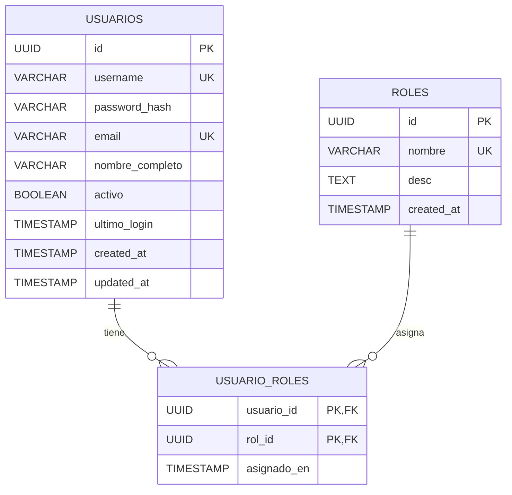

#### Negocio

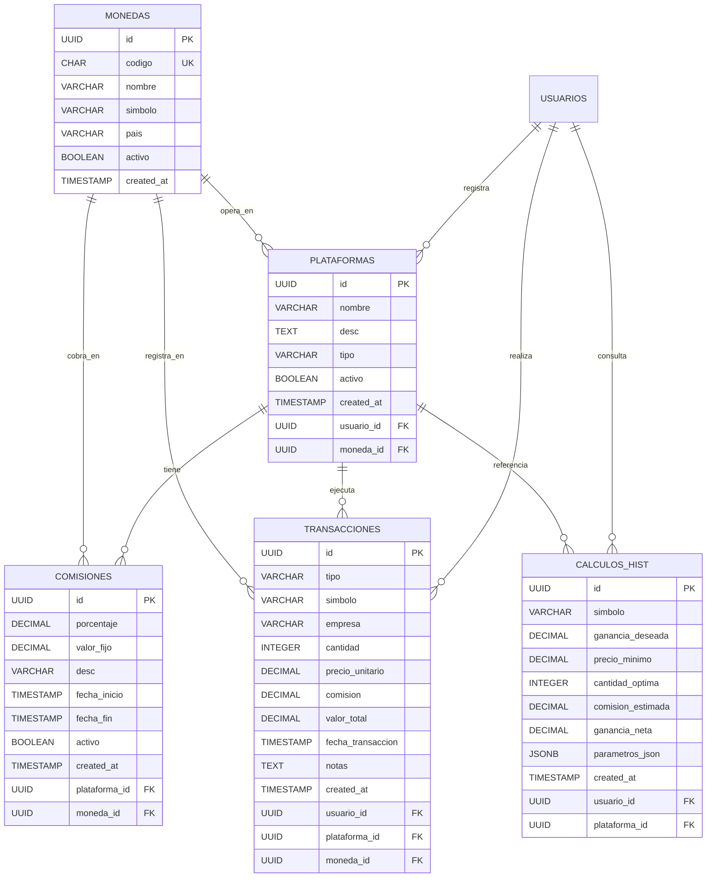

### Relaciones Clave

| Origen      | Destino       | Tipo | Descripción                                   |
| ----------- | ------------- | ---- | --------------------------------------------- |
| usuarios    | usuario_roles | 1:N  | Un usuario tiene varios roles                 |
| roles       | usuario_roles | 1:N  | Un rol pertenece a varios usuarios            |
| usuarios    | plataformas   | 1:N  | Un usuario registra varias plataformas        |
| monedas     | plataformas   | 1:N  | Una plataforma opera en una moneda            |
| plataformas | comisiones    | 1:N  | Una plataforma tiene estructura de comisiones |
| monedas     | comisiones    | 1:N  | La comisión se cobra en una moneda            |
| usuarios    | transacciones | 1:N  | Un usuario realiza varias transacciones       |
| plataformas | transacciones | 1:N  | Una transacción se ejecuta en una plataforma  |
| monedas     | transacciones | 1:N  | Una transacción se registra en una moneda     |
| usuarios    | calculos_hist | 1:N  | Historial de cálculos por usuario             |

Se incluyen **54 divisas internacionales** organizadas por región: principales (USD, COP, EUR, GBP), Américas (16), Europa (11), Asia-Pacífico (14) y Medio Oriente/África (9). Cada moneda tiene código ISO de 3 letras, nombre, símbolo y país asociado.

### Funciones PL/pgSQL Disponibles

| Función                   | Descripción                                   |
| ------------------------- | --------------------------------------------- |
| `obtener_comision_actual` | Retorna la comisión vigente de una plataforma |
| `calcular_comision`       | Calcula la comisión total para un monto dado  |
| `resumen_inversiones`     | Retorna las posiciones actuales por símbolo   |
| `calcular_venta_optima`   | Calcula precio mínimo para ganancia deseada   |

> Las funciones reciben y retornan UUIDs. Ver `database/sql/02_functions.sql` para detalles de parámetros.

### Datos de Prueba

- **3 usuarios**: demo_user, admin, incognito (con roles USER, ADMIN y PREMIUM)
- **5 plataformas**: eToro, Interactive Brokers, Robinhood, Binance (USD) y Trii (COP)
- **11 transacciones** de ejemplo en USD y COP con fechas en UTC
- **54 divisas internacionales** elegidas por las mas destacadas de cada continente

## 3. BACKEND - JAVA SPRING BOOT 3.x

### Servicios Publicados

| Endpoint                     | Método | Auth                   | Descripción                                              |
| ---------------------------- | ------ | ---------------------- | -------------------------------------------------------- |
| `/api/auth/login`            | POST   | No                     | Login - Retorna JWT + Refresh Token                      |
| `/api/auth/restart-password` | POST   | ADMIN                  | Restablecer contraseña de cualquier usuario              |
| `/api/auth/refresh-token`    | POST   | No (usa refresh token) | Renueva el access token usando un refresh token válido   |
| `/api/test/health`           | GET    | No                     | Health check del servicio                                |
| `/api/encryption/encrypt`    | POST   | ADMIN                  | Encriptar texto con AES-GCM                              |
| `/api/encryption/decrypt`    | POST   | ADMIN                  | Desencriptar texto con AES-GCM                           |
| `/api/auth/logout`           | POST   | JWT                    | Cerrar sesión - invalida el token y el refresh token     |
| `/api/auth/recovery/request` | POST   | No                     | Solicitar recuperación - envía token 6 dígitos por email |
| `/api/auth/recovery/verify`  | POST   | No                     | Verificar token y cambiar contraseña                     |
| `/api/auth/change-my-pass`   | POST   | JWT                    | Cambiar contraseña propia con validación actual          |

### Diagrama de secuencia de Los Servicios publicados:

#### Login

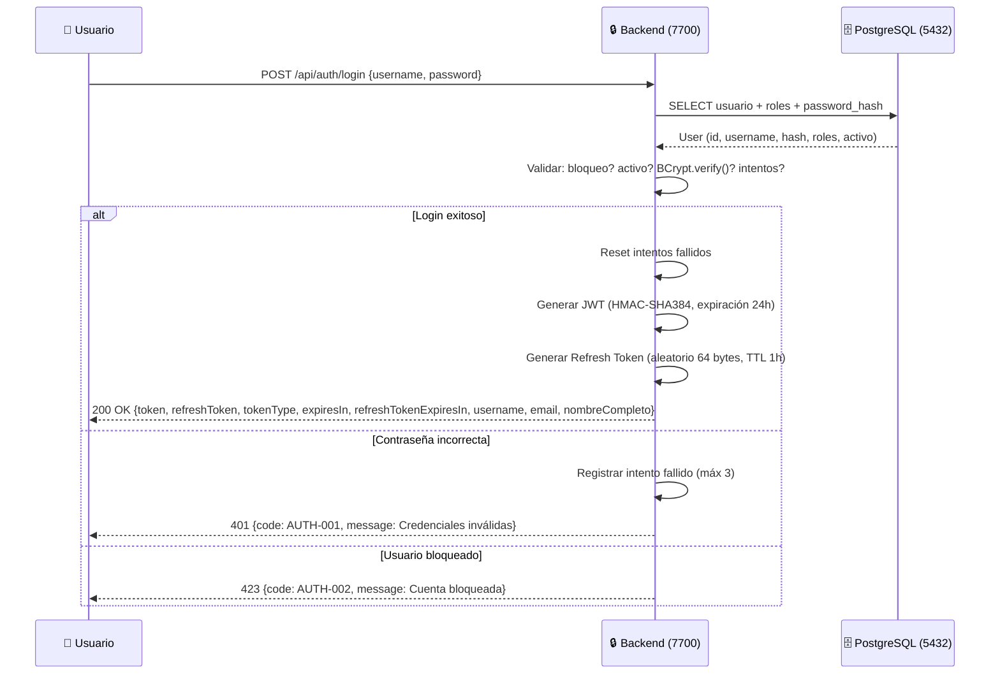

#### Restart Password (solo ADMIN)

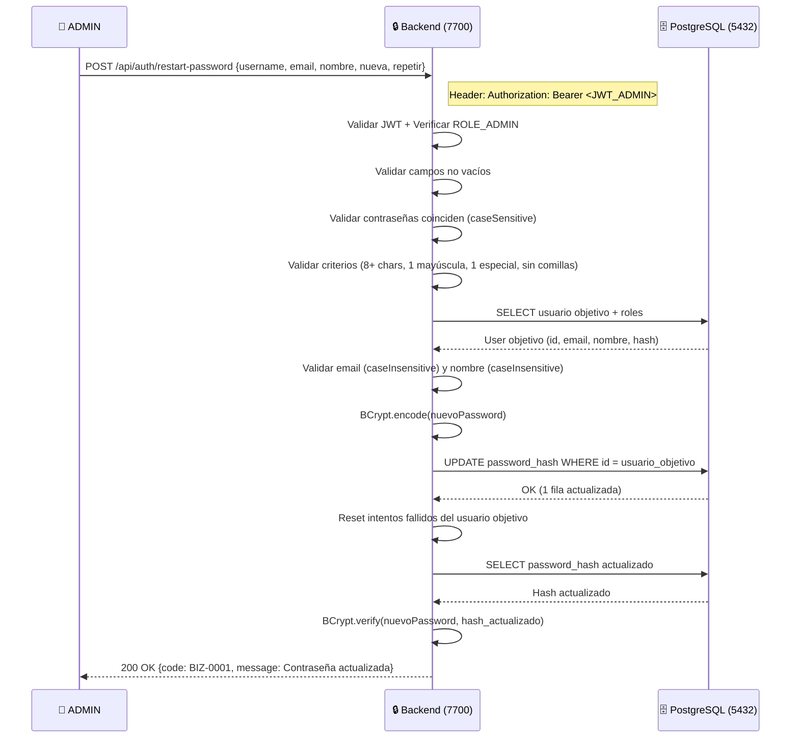

#### Encriptar Texto (ADMIN)

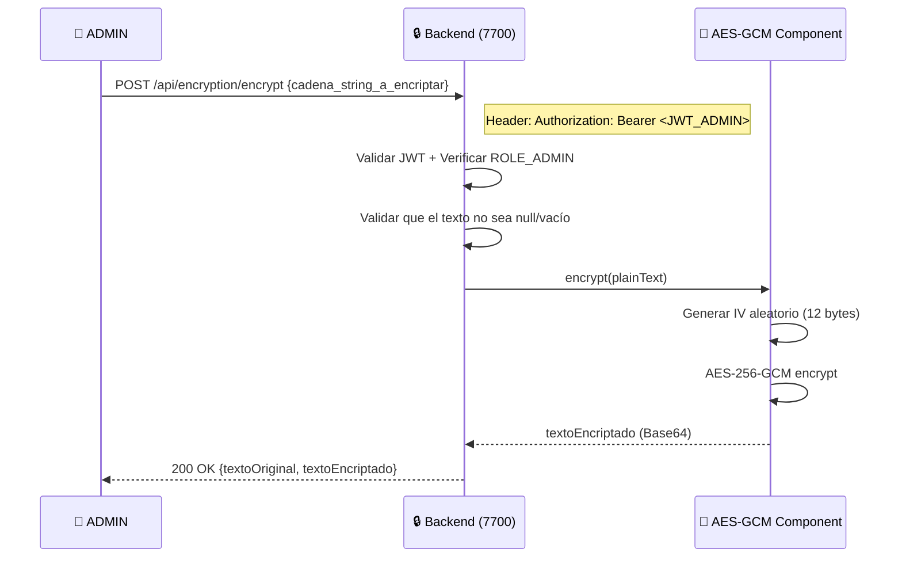

#### Desencriptar Texto (ADMIN)

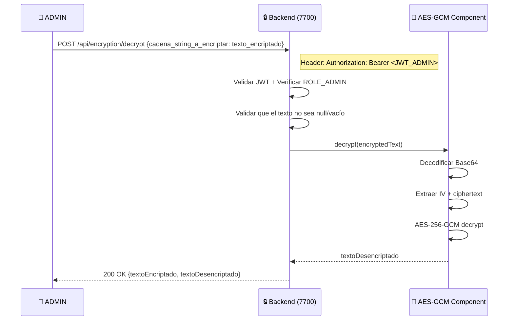

#### Logout (Cerrar Sesión)

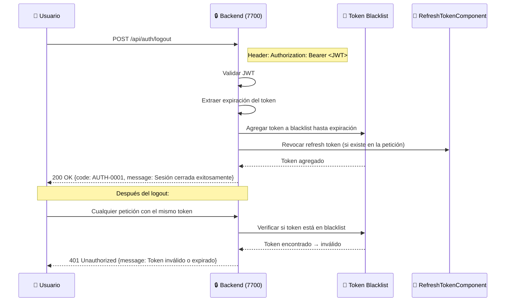

#### Recuperación de Contraseña (2FA SMTP)

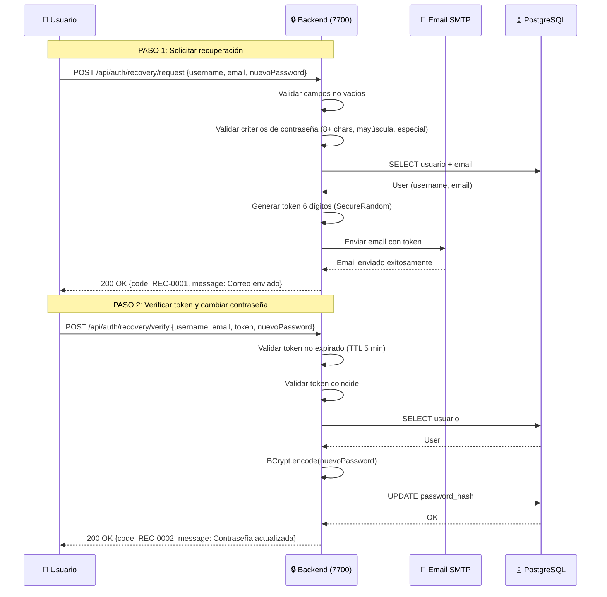

#### Refresh Token

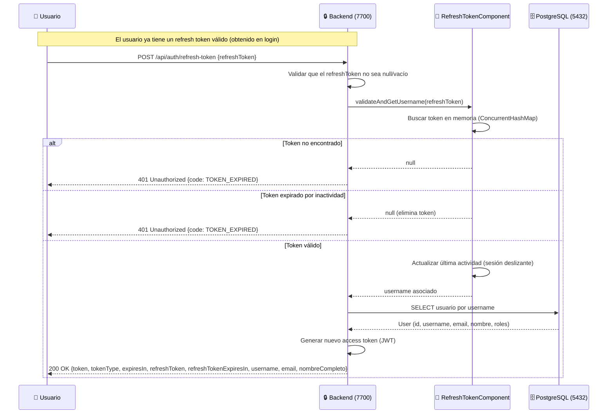

#### Change My Password

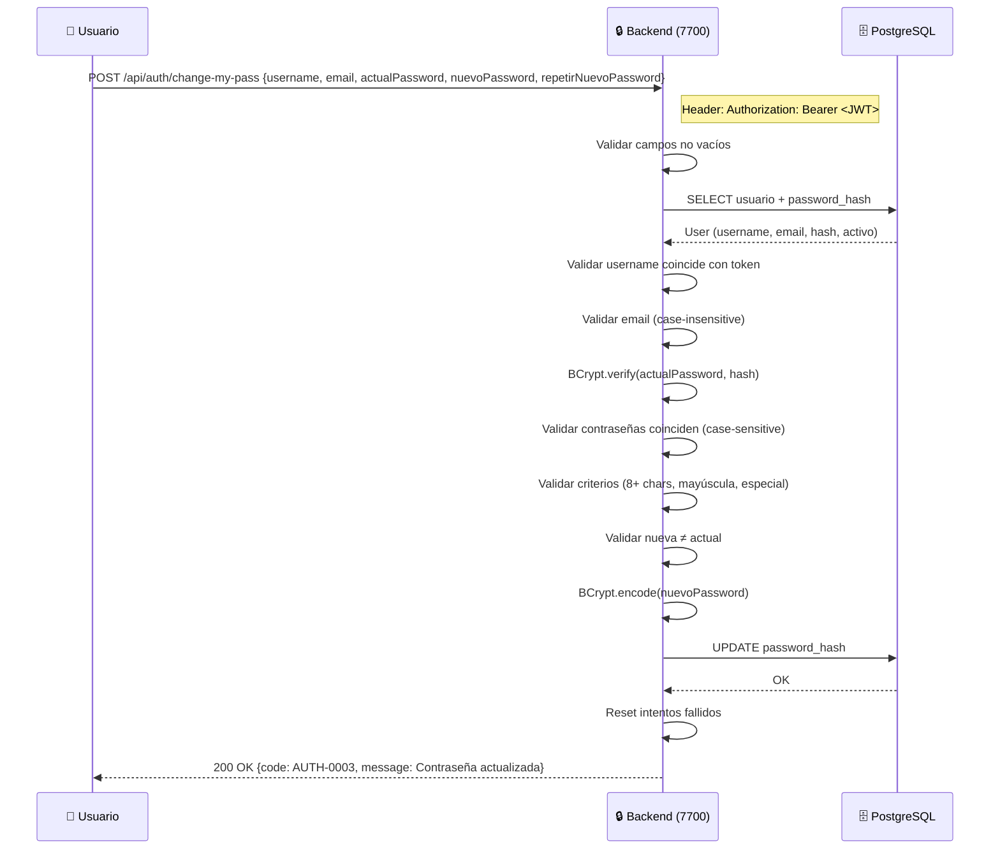

### Seguridad

- **JWT** con firma HMAC-SHA384
- **AES-256-GCM** para encriptación bidireccional de datos sensibles
- **BCrypt** para hash de contraseñas
- **Roles**: ROLE_ADMIN, ROLE_USER, ROLE_PREMIUM
- Control de intentos fallidos: 3 intentos, bloqueo progresivo (5min → 15min → 30min → 1h → 12h → 24h → permanente)
- Validaciones de contraseña: 8+ caracteres, 1 mayúscula, 1 carácter especial, sin comillas
- Validación case-insensitive para email, case-sensitive para contraseñas
- **2FA SMTP** para recuperación de contraseña con token de 6 dígitos
- **Refresh Token**: Se genera un token adicional en el login, válido por 1 hora, que permite renovar el access token sin necesidad de reautenticación. La renovación se realiza mediante una sesión deslizante (cada uso extiende la expiración 1 hora más). Los refresh tokens se almacenan en memoria (ConcurrentHashMap) y se invalidan al hacer logout o al expirar. La configuración completa (TTL, tiempos, etc.) se gestiona en el archivo application.yml bajo la clave refresh-token.

### Pruebas

- **70 pruebas automatizadas** (integración + unitarias)

- Cobertura: login, restart-password, change-my-password, recuperación 2FA SMTP, encriptación AES-GCM, control de roles, bloqueos, refresh token.

- Ejecutar todas: `mvn test`

- Ejecutar suite específica: `mvn test -Dtest=NombreDeLaSuite`

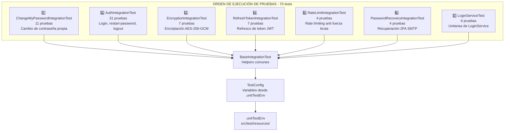

**Arquitectura de pruebas:**

- `.unitTestEnv`: archivo de configuración con todos los datos de prueba (usuarios, contraseñas, URLs) ubicado en `src/test/resources/`

- `BaseIntegrationTest`: helpers comunes (`loginAndGetToken`, `toJson`, `printBanner`, `clearBlacklist`).  
  **Nota:** En el método `clearBlacklist()` (ejecutado en `@BeforeEach`) se limpian la blacklist de tokens JWT y el rate limiter, pero **no** se limpian los refresh tokens. Esto es intencional para permitir que las pruebas de `RefreshTokenIntegrationTest` generen un refresh token en una prueba y lo reutilicen en pruebas posteriores dentro de la misma suite.

- `TestConfig`: variables centralizadas desde `.unitTestEnv`

- `@BeforeEach`: se utiliza en la mayoría de las pruebas para obtener un token fresco (login) antes de cada test, garantizando independencia total entre ellos.  
  **Excepciones:**
  - **`ChangeMyPasswordIntegrationTest`**: No usa `@BeforeEach` para obtener tokens, ya que al cambiar la contraseña del usuario `demo_user` en la prueba 2, el login posterior con la contraseña antigua fallaría y bloquearía al usuario. En su lugar, se usa `@BeforeAll` (ver más abajo).
  - **`RefreshTokenIntegrationTest`**: No usa `@BeforeEach` porque necesita que el refresh token generado en la prueba 1 persista hasta la prueba 2 (no se debe limpiar entre pruebas). La limpieza automática de refresh tokens está deshabilitada en `BaseIntegrationTest`.

- `@AfterEach`: se utiliza en algunas pruebas para limpiar estados o restaurar datos después de cada test.  
  **Excepción:** En `ChangeMyPasswordIntegrationTest` no se usa `@AfterEach`, ya que la restauración de la contraseña original se realiza explícitamente en la última prueba (CMP-11) utilizando un token de administrador.

- `@BeforeAll`: se usa **únicamente** en `ChangeMyPasswordIntegrationTest` para obtener los tokens de `demo_user` y `admin` una sola vez antes de todas las pruebas de esa clase. Esto evita que el cambio de contraseña afecte a los logins posteriores y previene el bloqueo del usuario por intentos fallidos.  
  El comentario asociado en el código es el siguiente:

```java
/**
 * Importante NUNCA se debe usar @BeforeEach ni @AfterEach para obtener tokens,
 * ya que se reinicia el estado de la base de datos y se invalidan los tokens.
 * Por eso se usa @BeforeAll para obtener los tokens una sola vez antes de todas
 * las pruebas.
 *
 * @throws Exception
 */
```

### Servicios

| Servicio    | Puerto | URL                   |
| ----------- | ------ | --------------------- |
| PostgreSQL  | 5432   | localhost:5432        |
| pgAdmin     | 5050   | http://localhost:5050 |
| Backend     | 7700   | http://localhost:7700 |
| Frontend    | 3000   | http://localhost:3000 |
| Nginx HTTPS | 443    | https://localhost     |

```
┌──────────────────────────────────────────────────────────────┐
│                  DOCKER COMPOSE NETWORK                       │
│                  investment_network (bridge)                  │
│                                                              │
│  ┌──────────────────┐  ┌──────────────────┐                 │
│  │  investment-db    │  │ investment-backend│                │
│  │  postgres:16-alp  │  │ spring-boot:3.x  │                 │
│  │  :5432 → :5432    │◄─┤ :7700 → :7700    │                 │
│  │  volume: data     │  │ JWT + BCrypt     │                 │
│  └──────────────────┘  └──────────────────┘                 │
│                                                              │
│  ┌──────────────────┐  ┌──────────────────┐                 │
│  │ investment-pgadmin│  │ investment-nginx  │                 │
│  │ pgadmin4:latest   │  │ nginx:alpine     │                 │
│  │ :5050 → :80       │  │ :80, :443        │                 │
│  │ volume: pgadmin   │  │ SSL + proxy      │                 │
│  └──────────────────┘  └──────────────────┘                 │
└──────────────────────────────────────────────────────────────┘
```

### Scripts de Mantenimiento

#### Verificar sistema completo

./docker/shellTest/check-all.sh

#### Reset base de datos (mantiene configuración pgadmin)

./docker/shellTest/reset-all.sh

#### Reset solo pgadmin

./docker/shellTest/reset-pgadmin.sh

#### Backup base de datos

./docker/shellTest/backup-db.sh

#### Restaurar backup

./docker/shellTest/restore-db.sh <archivo.sql>

### 101. Estructura del Proyecto

#### Estructura detallada de archivos (185 archivos, 82 directorios)

- **`investment-tracker/`** - Raíz del proyecto
  - `.gitignore` - Archivos ignorados por Git
  - `LICENSE` - Licencia del proyecto
  - `README.md` - Documentación principal
  - **`.vscode/`**
    - `settings.json` - Configuración de VS Code
  - **`docker/`** - Contenedores y orquestación
    - `docker-compose.yml` - Orquestación de servicios
    - `Dockerfile.backend` - Imagen para Spring Boot
    - `Dockerfile.frontend` - Imagen para React
    - **`nginx/`**
      - `default.conf` - Reverse proxy HTTPS
      - `nginx-frontend.conf` - Servidor frontend
      - **`ssl/`**
        - `localhost.crt` - Certificado SSL autofirmado
        - `localhost.key` - Llave privada SSL
    - **`pgadmin/`**
      - `servers.json` - Configuración servidores pgAdmin
    - **`postgres/`**
      - `init.sql` - Inicialización de BD
    - **`shellTest/`** - Scripts de mantenimiento
      - `backup-db.sh` - Backup de BD
      - `check-all.sh` - Verificación completa
      - `final-check-uuid.sh` - Verificación UUID
      - `reset-all.sh` - Reset BD (mantiene pgadmin)
      - `reset-pgadmin.sh` - Reset solo pgadmin
      - `restore-db.sh` - Restaurar desde backup
  - **`database/`** - Base de datos
    - **`MER/`**
      - `diagram.md` - Diagrama entidad-relación
    - **`sql/`**
      - `01_schema.sql` - Esquema v2.1.0 (UUID + Monedas)
      - `02_functions.sql` - Funciones PL/pgSQL v2.0.0
      - `03_seed.sql` - Datos iniciales v2.1.0
  - **`backend/`** - API REST Spring Boot 3.x + Java 21
    - `pom.xml` - Dependencias Maven
    - **`src/`**
      - **`main/`**
        - **`java/`**
          - **`com/`**
            - **`investmenttracker/`**
              - `InvestmentTrackerApplication.java` - Clase principal (puerto 7700)
              - **`component/`** - Componentes reutilizables
                - `AESEncryptionComponent.java` - Encriptación AES-256-GCM
                - `LoginComponent.java` - Control de intentos fallidos y bloqueos
                - `RateLimitComponent.java` - Limitador de peticiones por IP
                - `RefreshTokenComponent.java` - Gestión de refresh tokens
                - `SecurityLoginComponent.java` - Encriptación BCrypt + validación
                - `TokenBlacklistComponent.java` - Blacklist de tokens JWT
              - **`config/`** - Configuración de Spring
                - `EncryptedDataSourceConfig.java` - DataSource con desencriptación AES
                - `MailConfig.java` - Configuración SMTP con desencriptación
                - `SecurityConfig.java` - Spring Security + JWT
              - **`controller/`** - Endpoints REST
                - `AuthController.java` - Login + restart-password + logout + change-my-pass
                - `EncryptionController.java` - Encriptación/desencriptación AES-GCM
                - `PasswordRecoveryController.java` - Recuperación de contraseña (2FA SMTP)
                - `TestValidationController.java` - Health check
              - **`exception/`** - Manejo de excepciones
                - `AuthenticationException.java` - Excepción personalizada
                - `GlobalExceptionHandler.java` - Manejador global de excepciones
              - **`model/`** - Modelos de datos
                - **`dto/`** - Data Transfer Objects
                  - `UserPasswordDTO.java` - DTO para cambio de contraseña
                - **`entity/`** - Entidades JPA
                  - `Role.java` - Entidad de roles
                  - `User.java` - Entidad de usuarios
                - **`enums/`** - Enumeraciones de respuesta
                  - `ErrorCode.java` - Códigos de error
                  - `LockLevel.java` - Niveles de bloqueo
                  - `SuccessfulCode.java` - Códigos de éxito
                - **`request/`** - Objetos de petición
                  - `ChangePasswordRequest.java` - Solicitud de cambio de contraseña
                  - `EncryptionRequest.java` - Solicitud de encriptación
                  - `LoginRequest.java` - Solicitud de login
                  - `PasswordRecoveryRequest.java` - Solicitud de recuperación
                  - `RestartPasswordRequest.java` - Solicitud de reinicio (admin)
                  - `TokenVerificationRequest.java` - Verificación de token
                - **`response/`** - Objetos de respuesta
                  - `EncryptionResponse.java` - Respuesta de encriptación
                  - `ErrorResponse.java` - Respuesta de error
                  - `LoginResponse.java` - Respuesta de login
                  - `SuccessResponse.java` - Respuesta de éxito
              - **`repository/`** - Repositorios JPA
                - `UserRepository.java` - Repositorio de usuarios
              - **`security/`** - Capa de seguridad
                - `JwtAuthFilter.java` - Filtro de autenticación JWT
                - `RateLimitFilter.java` - Filtro de límite de peticiones
                - `UserDetailsServiceImpl.java` - Carga de usuarios desde BD
              - **`service/`** - Lógica de negocio
                - `ChangeMyPasswordService.java` - Cambio de contraseña propia
                - `EmailService.java` - Envío de correos SMTP
                - `EncryptionService.java` - Encriptación AES-GCM
                - `JwtService.java` - Generación/validación JWT
                - `LoginService.java` - Autenticación + control de intentos
                - `LogoutService.java` - Cierre de sesión con blacklist
                - `PasswordRecoveryService.java` - Recuperación con 2FA
                - `RefreshTokenService.java` - Servicio de refresh tokens
                - `RestartUserPasswordService.java` - Restablecer contraseña (ADMIN)
        - **`resources/`**
          - `application.yml` - Configuración (DB encriptada, JWT, SMTP, puerto 7700)
      - **`test/`** - Pruebas
        - **`java/`**
          - **`com/`**
            - **`investmenttracker/`**
              - **`config/`**
                - `TestConfig.java` - Configuración de pruebas
              - **`controller/`** - Pruebas de integración
                - `AuthIntegrationTest.java` - Pruebas de autenticación (31 casos)
                - `BaseIntegrationTest.java` - Clase base para pruebas
                - `ChangeMyPasswordIntegrationTest.java` - Pruebas de cambio de contraseña
                - `EncryptionIntegrationTest.java` - Pruebas de encriptación
                - `PasswordRecoveryIntegrationTest.java` - Pruebas de recuperación
                - `RateLimitIntegrationTest.java` - Pruebas de rate limit
                - `RefreshTokenIntegrationTest.java` - Pruebas de refresh token
              - **`service/`** - Pruebas unitarias
                - `LoginServiceTest.java` - Pruebas del servicio de login
        - **`resources/`**
    - **`target/`** - Compilados y reportes (generado por Maven)
      - **`classes/`** - Clases compiladas
      - **`generated-sources/`** - Código fuente generado
      - **`generated-test-sources/`** - Código de pruebas generado
      - **`maven-status/`** - Estado de Maven
      - **`surefire-reports/`** - Reportes de pruebas
      - **`test-classes/`** - Clases de pruebas compiladas
  - **`frontend/`** - SPA React 18 (estructura inicial)
    - `package.json` - Dependencias npm
    - `README.md` - Documentación frontend
    - **`src/`**
      - `App.js` - Componente principal
      - **`component/`**
        - `Dashboard.js` - Panel de control
      - **`services/`**
        - `api.js` - Configuración Axios
      - **`styles/`**
        - `global.css` - Estilos globales
  - **`docs/`** - Documentación
    - `README_IdeaICompletaDeArchivos.md` - Idea completa de arquitectura
    - **`prompts/`**
      - `prompt_inicial.md` - Prompt original
    - **`serverConfig/`**
      - `popOS22.04.md` - Guía de instalación en Pop!\_OS 22.04
    - **`sql/`**
      - `consultasBasicas.sql` - Consultas de referencia
  - **`backups/`** - Copias de seguridad de la base de datos
    - `investment_tracker_20260710_121428.sql` - Backup de BD

### 103. Requisitos Funcionales

1. Sistema de autenticación con JWT y refresh token.

### 104. Stack Tecnológico

- **Backend**: Java LTS 21 (Spring Boot 3.x)
- **Base de datos**: PostgreSQL 16
- **Frontend**: React 18+ con CSS moderno
- **Servidor Web**: Tomcat 10 (embebido en Spring Boot)
- **Seguridad**: HTTPS + JWT + Refresh Token
- **Contenedores**: Docker + Docker Compose
- **Gestion de DB**: pgadmin 4 Latest
- **Control de versiones**: Git/GitHub
- **Sistema Operativo**: Pop OS 22.04
- **IDE**: Visual Studio Code
