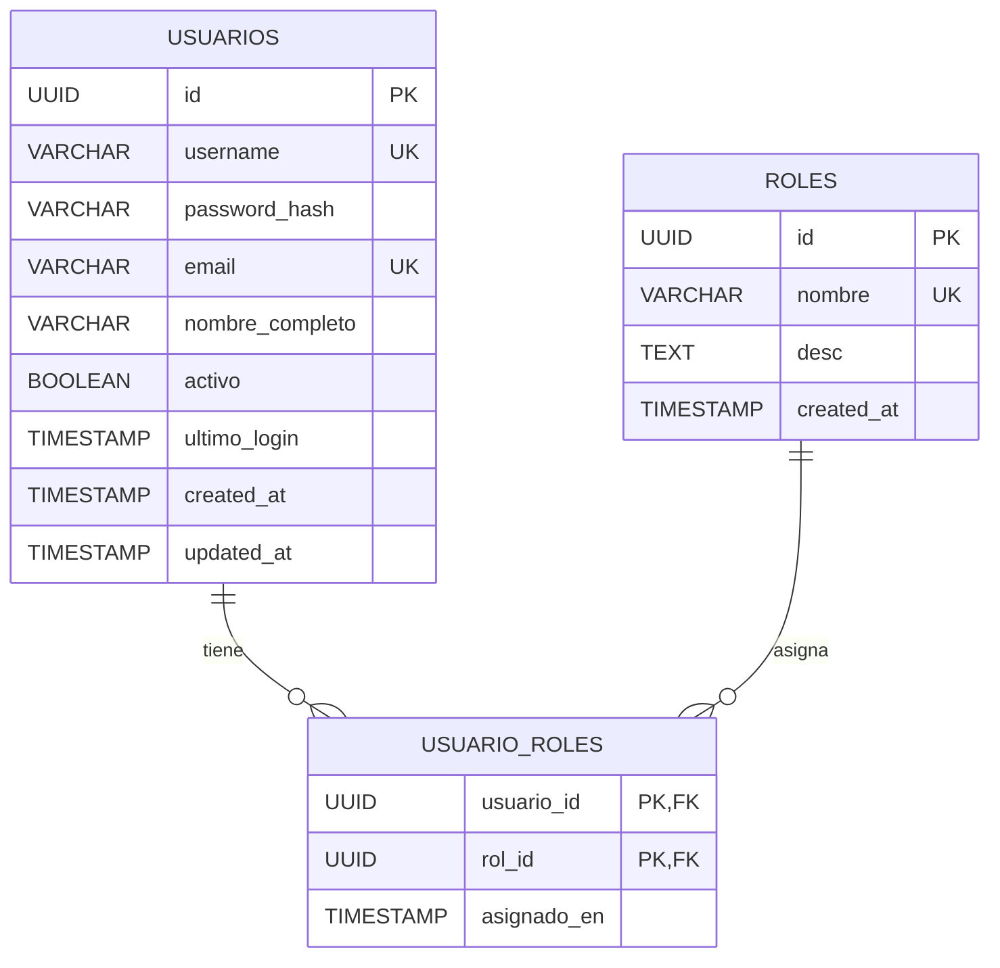
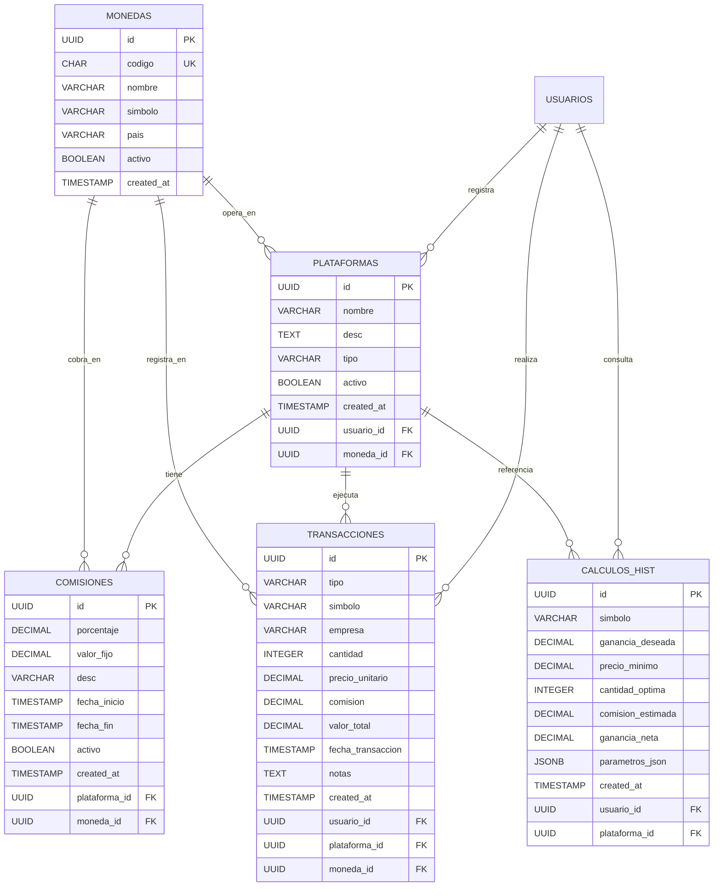
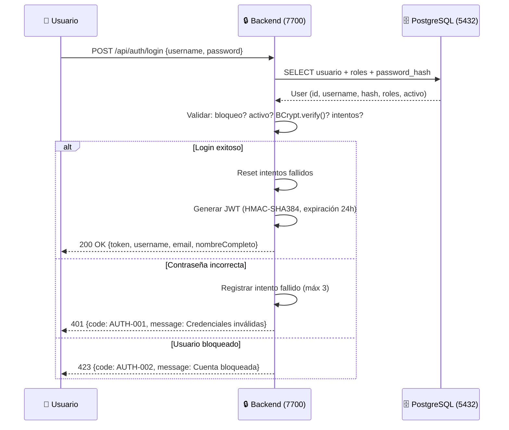
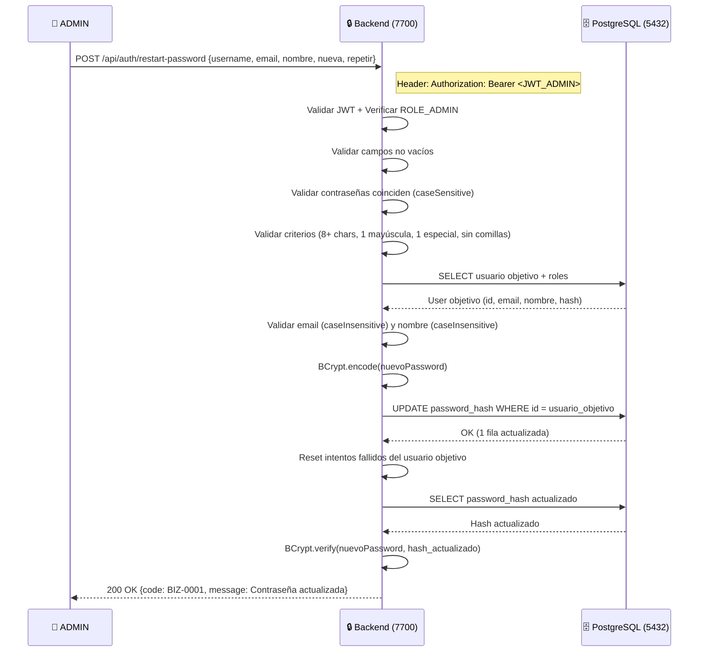
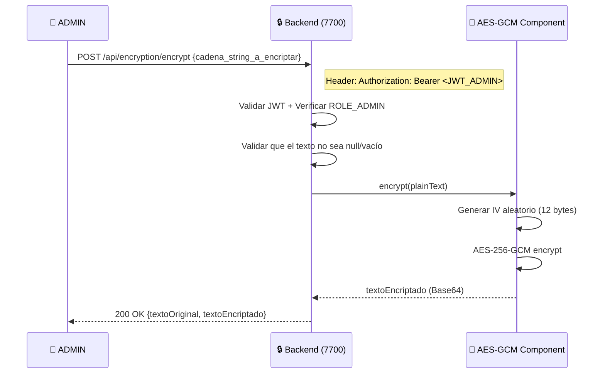
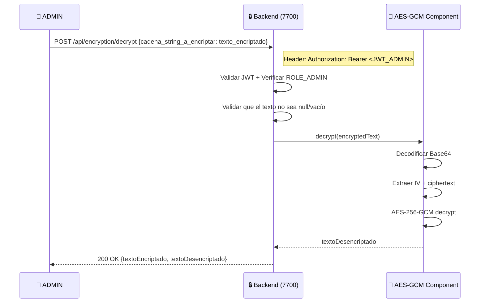

# PROMPT INICIAL - Sistema de Gestión de Inversiones

## Fecha: 2026-08-16

## Proyecto: Investment Tracker Pro

### Descripción General

Aplicación web para seguimiento de inversiones con arquitectura de microservicios usando Docker.

### Requisitos Funcionales

1. Sistema de autenticación con JWT
2. Roles de usuario
3. Registro de inversiones en múltiples plataformas
4. Gestión de comisiones variables por plataforma
5. Registro de compras y ventas de acciones
6. Dashboard de resultados de inversiones
7. Calculadora de venta óptima para ganancias objetivo

---

# Investment Tracker Pro - Documentación Completa

## ÍNDICE

- [1. Arquitectura del Sistema](#1-arquitectura-del-sistema)
  - [Diagrama de Arquitectura](#diagrama-de-arquitectura)

- [2. Base de Datos](#2-base-de-datos)
  - [Diagrama MER (Modelo Entidad-Relación)](#diagrama-mer-modelo-entidad-relación)
    - [Login](#login)
    - [Negocio](#negocio)
  - [Relaciones Clave](#relaciones-clave)
  - [Funciones PL/pgSQL Disponibles](#funciones-plpgsql-disponibles)
  - [Datos de Prueba](#datos-de-prueba)

- [3. Backend - Java Spring Boot](#3-backend---java-spring-boot-3x)
  - [Servicios Publicados](#servicios-publicados)
  - [Diagrama de Secuencia de los Servicios](#diagrama-de-secuencia-de-los-servicios-publicados)
    - [Login](#login-1)
    - [Restart Password (solo ADMIN)](#restart-password-solo-admin)
    - [Encriptar Texto (ADMIN)](#encriptar-texto-admin)
    - [Desencriptar Texto (ADMIN)](#desencriptar-texto-admin)
  - [Seguridad](#seguridad)
  - [Pruebas](#pruebas)

- [4. Frontend - React y CSS moderno](#4-frontend---react-y-css-moderno)

- [5. Nginx - publicación](#5-Nginx---publicación)

- [100. Servicios Docker](#100-servicios-docker)
  - [Servicios](#servicios)
  - [Scripts de Mantenimiento](#scripts-de-mantenimiento)
    - [Verificar sistema completo](#verificar-sistema-completo)
    - [Reset base de datos](#reset-base-de-datos-mantiene-configuración-pgadmin)
    - [Reset solo pgadmin](#reset-solo-pgadmin)
    - [Backup base de datos](#backup-base-de-datos)
    - [Restaurar backup](#restaurar-backup)

- [101. Estructura del Proyecto](#101-estructura-del-proyecto)
  - [Estructura detallada de archivos](#estructura-detallada-de-archivos)

- [102. Historial de Versiones](#102-historial-de-versiones)

- [103. Requisitos Funcionales](#103-requisitos-funcionales)

- [104. Stack Tecnológico](#104-stack-tecnológico)

---

## 1. ARQUITECTURA DEL SISTEMA

### Diagrama de Arquitectura

```
┌─────────────────────────────────────────────────────────────┐
│                      🌐 CLIENTE (HTTPS)                      │
│                   React SPA + Axios + JWT                    │
└──────────────────────────┬──────────────────────────────────┘
                           │
                           ▼
┌─────────────────────────────────────────────────────────────┐
│                   🔒 NGINX Reverse Proxy                     │
│                      Puerto: 443 (SSL/TLS)                   │
│                  Redirección: / → Frontend                   │
│                              /api → Backend                  │
└──────────────────────────┬──────────────────────────────────┘
                           │
            ┌──────────────┴──────────────┐
            ▼                             ▼
┌───────────────────────┐    ┌────────────────────────────────┐
│   🎨 FRONTEND (3000)   │    │   ⚙️  BACKEND (7700)            │
│   React 18 + CSS       │    │   Spring Boot 3.x + Java 21   │
│   Nginx/Alpine         │    │   Tomcat 10 Embedido           │
│   SPA + React Router   │    │   JWT Authentication           │
└───────────────────────┘    └──────────────┬─────────────────┘
                                            │
                    ┌───────────────────────┴
                    │
                    ▼
┌──────────────────────────────┐    ┌──────────────────────────────┐
│   🗄️  PostgreSQL 16 (5432)    │◄──│   📊 pgAdmin 4 (5050)        │
│   Esquema: investment_tracker│    │   Admin DB Web UI            │
│   PL/pgSQL + UUID + 54 monedas│   │   http://localhost:5050       │
└──────────────────────────────┘    └──────────────────────────────┘
```

## 2. BASE DE DATOS

### Diagrama MER (Modelo Entidad-Relación)

#### Login



#### Negocio



### Relaciones Clave

| Origen      | Destino       | Tipo | Descripción                                   |
| ----------- | ------------- | ---- | --------------------------------------------- |
| usuarios    | usuario_roles | 1:N  | Un usuario tiene varios roles                 |
| roles       | usuario_roles | 1:N  | Un rol pertenece a varios usuarios            |
| usuarios    | plataformas   | 1:N  | Un usuario registra varias plataformas        |
| monedas     | plataformas   | 1:N  | Una plataforma opera en una moneda            |
| plataformas | comisiones    | 1:N  | Una plataforma tiene estructura de comisiones |
| monedas     | comisiones    | 1:N  | La comisión se cobra en una moneda            |
| usuarios    | transacciones | 1:N  | Un usuario realiza varias transacciones       |
| plataformas | transacciones | 1:N  | Una transacción se ejecuta en una plataforma  |
| monedas     | transacciones | 1:N  | Una transacción se registra en una moneda     |
| usuarios    | calculos_hist | 1:N  | Historial de cálculos por usuario             |

Se incluyen **54 divisas internacionales** organizadas por región: principales (USD, COP, EUR, GBP), Américas (16), Europa (11), Asia-Pacífico (14) y Medio Oriente/África (9). Cada moneda tiene código ISO de 3 letras, nombre, símbolo y país asociado.

### Funciones PL/pgSQL Disponibles

| Función                   | Descripción                                   |
| ------------------------- | --------------------------------------------- |
| `obtener_comision_actual` | Retorna la comisión vigente de una plataforma |
| `calcular_comision`       | Calcula la comisión total para un monto dado  |
| `resumen_inversiones`     | Retorna las posiciones actuales por símbolo   |
| `calcular_venta_optima`   | Calcula precio mínimo para ganancia deseada   |

> Las funciones reciben y retornan UUIDs. Ver `database/sql/02_functions.sql` para detalles de parámetros.

### Datos de Prueba

- **3 usuarios**: demo_user, admin, incognito (con roles USER, ADMIN y PREMIUM)
- **5 plataformas**: eToro, Interactive Brokers, Robinhood, Binance (USD) y Trii (COP)
- **11 transacciones** de ejemplo en USD y COP con fechas en UTC
- **54 divisas internacionales** elegidas por las mas destacadas de cada continente

## 3. BACKEND - JAVA SPRING BOOT 3.x

### Servicios Publicados

| Endpoint                     | Método | Auth  | Descripción                                 |
| ---------------------------- | ------ | ----- | ------------------------------------------- |
| `/api/auth/login`            | POST   | No    | Login - Retorna JWT                         |
| `/api/auth/restart-password` | POST   | ADMIN | Restablecer contraseña de cualquier usuario |
| `/api/test/health`           | GET    | No    | Health check del servicio                   |
| `/api/encryption/encrypt`    | POST   | ADMIN | Encriptar texto con AES-GCM                 |
| `/api/encryption/decrypt`    | POST   | ADMIN | Desencriptar texto con AES-GCM              |

### Diagrama de secuencia de Los Servicios publicados:

#### Login



#### Restart Password (solo ADMIN)



#### Encriptar Texto (ADMIN)



#### Desencriptar Texto (ADMIN)



### Seguridad

- **JWT** con firma HMAC-SHA384
- **AES-256-GCM** para encriptación bidireccional de datos sensibles
- **BCrypt** para hash de contraseñas
- **Roles**: ROLE_ADMIN, ROLE_USER, ROLE_PREMIUM
- Control de intentos fallidos: 3 intentos, bloqueo progresivo (5min → 15min → 30min → 1h → 12h → 24h → permanente)
- Validaciones de contraseña: 8+ caracteres, 1 mayúscula, 1 carácter especial, sin comillas
- Validación case-insensitive para email, case-sensitive para contraseñas

### Pruebas

- **32 pruebas automatizadas** (26 integración + 6 unitarias)
- Cobertura: login, restart-password, validaciones de contraseña, control de roles, bloqueos
- Ejecutar: `mvn test`

## 100. Servicios Docker

### Servicios

| Servicio    | Puerto | URL                   |
| ----------- | ------ | --------------------- |
| PostgreSQL  | 5432   | localhost:5432        |
| pgAdmin     | 5050   | http://localhost:5050 |
| Backend     | 7700   | http://localhost:7700 |
| Frontend    | 3000   | http://localhost:3000 |
| Nginx HTTPS | 443    | https://localhost     |

```
┌──────────────────────────────────────────────────────────────┐
│                  DOCKER COMPOSE NETWORK                       │
│                  investment_network (bridge)                  │
│                                                              │
│  ┌──────────────────┐  ┌──────────────────┐                 │
│  │  investment-db    │  │ investment-backend│                │
│  │  postgres:16-alp  │  │ spring-boot:3.x  │                 │
│  │  :5432 → :5432    │◄─┤ :7700 → :7700    │                 │
│  │  volume: data     │  │ JWT + BCrypt     │                 │
│  └──────────────────┘  └──────────────────┘                 │
│                                                              │
│  ┌──────────────────┐  ┌──────────────────┐                 │
│  │ investment-pgadmin│  │ investment-nginx  │                 │
│  │ pgadmin4:latest   │  │ nginx:alpine     │                 │
│  │ :5050 → :80       │  │ :80, :443        │                 │
│  │ volume: pgadmin   │  │ SSL + proxy      │                 │
│  └──────────────────┘  └──────────────────┘                 │
└──────────────────────────────────────────────────────────────┘
```

### Scripts de Mantenimiento

#### Verificar sistema completo

./docker/shellTest/check-all.sh

#### Reset base de datos (mantiene configuración pgadmin)

./docker/shellTest/reset-all.sh

#### Reset solo pgadmin

./docker/shellTest/reset-pgadmin.sh

#### Backup base de datos

./docker/shellTest/backup-db.sh

#### Restaurar backup

./docker/shellTest/restore-db.sh <archivo.sql>

### 101. Estructura del Proyecto

#### Estructura detallada de archivos

- **`investment-tracker/`** - Raíz del proyecto
  - `.gitignore` - Archivos ignorados por Git
  - `LICENSE` - Licencia del proyecto
  - `README.md` - Documentación principal
  - **`.vscode/`**
    - `settings.json` - Configuración de VS Code
  - **`docker/`** - Contenedores y orquestación
    - `.env` - Variables de entorno Docker
    - `docker-compose.yml` - Orquestación de servicios
    - `Dockerfile.backend` - Imagen para Spring Boot
    - `Dockerfile.frontend` - Imagen para React
    - **`nginx/`**
      - `default.conf` - Reverse proxy HTTPS
      - `nginx-frontend.conf` - Servidor frontend
      - **`ssl/`**
        - `localhost.crt` - Certificado SSL autofirmado
        - `localhost.key` - Llave privada SSL
    - **`pgadmin/`**
      - `servers.json` - Configuración servidores pgAdmin
    - **`postgres/`**
      - `init.sql` - Inicialización de BD
    - **`shellTest/`** - Scripts de mantenimiento
      - `check-all.sh` - Verificación completa
      - `reset-all.sh` - Reset BD (mantiene pgadmin)
      - `reset-pgadmin.sh` - Reset solo pgadmin
      - `backup-db.sh` - Backup de BD
      - `restore-db.sh` - Restaurar desde backup
      - `final-check-uuid.sh` - Verificación UUID
  - **`database/`** - Base de datos
    - **`sql/`**
      - `01_schema.sql` - Esquema v2.1.0 (UUID + Monedas)
      - `02_functions.sql` - Funciones PL/pgSQL v2.0.0
      - `03_seed.sql` - Datos iniciales v2.1.0
    - **`MER/`**
      - `diagram.md` - Diagrama entidad-relación
  - **`backend/`** - API REST Spring Boot 3.x + Java 21
    - `pom.xml` - Dependencias Maven
    - **`src/main/java/com/investmenttracker/`**
      - `InvestmentTrackerApplication.java` - Clase principal (puerto 7700)
      - **`config/`**
        - `SecurityConfig.java` - Spring Security + JWT
      - **`controller/`** - Endpoints REST
        - `AuthController.java` - Login + restart-password
        - `TestValidationController.java` - Health check
      - **`service/`** - Lógica de negocio
        - `LoginService.java` - Autenticación + control de intentos
        - `JwtService.java` - Generación/validación JWT
        - `RestartUserPasswordService.java` - Restablecer contraseña (ADMIN)
      - **`component/`** - Componentes reutilizables
        - `LoginComponent.java` - Control de intentos fallidos y bloqueos
        - `SecurityLoginComponent.java` - Encriptación BCrypt + validación
      - **`security/`** - Capa de seguridad
        - `JwtAuthFilter.java` - Filtro de autenticación JWT
        - `UserDetailsServiceImpl.java` - Carga usuarios desde BD
      - **`model/`** - Modelo de datos
        - **`entity/`** - `User.java`, `Role.java`
        - **`enums/`** - `ErrorCode.java`, `LockLevel.java`, `SuccessfulCode.java`
        - **`request/`** - `LoginRequest.java`, `RestartPasswordRequest.java`
        - **`response/`** - `LoginResponse.java`, `ErrorResponse.java`, `SuccessResponse.java`
        - **`dto/`** - `UserPasswordDTO.java`
      - **`repository/`** - `UserRepository.java`
      - **`exception/`** - `AuthenticationException.java`, `GlobalExceptionHandler.java`
    - **`src/main/resources/`**
      - `application.yml` - Configuración (DB, JWT, puerto 7700)
    - **`src/test/java/com/investmenttracker/`** - Pruebas (32 tests)
      - **`controller/`** - `AuthIntegrationTest.java` (26 pruebas de integración)
      - **`service/`** - `LoginServiceTest.java` (6 pruebas unitarias)
  - **`frontend/`** - SPA React 18 (estructura inicial)
    - `package.json` - Dependencias npm
    - `README.md` - Documentación frontend
    - **`src/`**
      - `App.js` - Componente principal
      - **`component/`** - `Dashboard.js`
      - **`services/`** - `api.js` - Configuración Axios
      - **`styles/`** - `global.css` - Estilos globales
  - **`docs/`** - Documentación
    - `README_IdeaICompletaDeArchivos.md` - Idea completa de arquitectura
    - **`prompts/`** - `prompt_inicial.md` - Prompt original
    - **`serverConfig/`** - `popOS22.04.md` - Guía de instalación
    - **`sql/`** - `consultasBasicas.sql` - Consultas de referencia

### 104. Stack Tecnológico

- **Backend**: Java LTS 21 (Spring Boot 3.x)
- **Base de datos**: PostgreSQL 16
- **Frontend**: React 18+ con CSS moderno
- **Servidor Web**: Tomcat 10 (embebido en Spring Boot)
- **Seguridad**: HTTPS + JWT
- **Contenedores**: Docker + Docker Compose
- **Gestion de DB**: pgadmin 4 Latest
- **Control de versiones**: Git/GitHub
- **Sistema Operativo**: Pop OS 22.04
- **IDE**: Visual Studio Code
